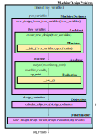

# MachEval
This repository houses the current code base used by the Severson Research Group to design, evaluate, and optimize electrical machines. The following links can be used to navigate to documentation on sub-sections of this repository.

1. [Machine Design Framework](MachineDesign.md)
1. [Machine Evaluation Framework](MachineDesign.md)
1. [Machine Optimization Framework](MachineDesign.md)

Some example optimization code for various machine topologies are provided in [here](/Examples).

## Code Structure Overview

The MachEval code base is designed to be utilized by [PYGMO](https://esa.github.io/pygmo2/index.html), an optimization library for Python. Each sub-sections of this repository is built to to interact with the components below it for various machine types and evaluation strategies. 

  

   Structure of Code Base

## Optimization Overview

A general flow chart for the design optimization is shown below which highlights the flow of information between the the various sub-sections of the code base.

  

   Optimization Flow Chart

