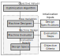
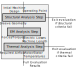

# eMach
An open source framework for electric machine optimization and evaluation. A detailed
documentation of this code base attributes and capabilities is available 
[here](https://emach.readthedocs.io/en/latest/index.html). A broad overview of the repository
is provided below.

## Optimization Workflow

The `eMach` optimization workflow has been developed to make electric machine design
and optimization flexible, modular, and easily extensible. A flowchart showing a 
broad view of the workflow is provided below. More information of each block illustrated
in this workflow is available [here](https://emach.readthedocs.io/en/latest/index.html).

  

   Structure of Optimization

At the Severson research group, we are particularly interested in the design and optimization
of bearingless electric machines. An expanded view of the `Machine Evaluator` for 
the optimization of these machines is shown below. The evaluator will be modified for
each optimization based on 

  

   Optimization Flow Chart

