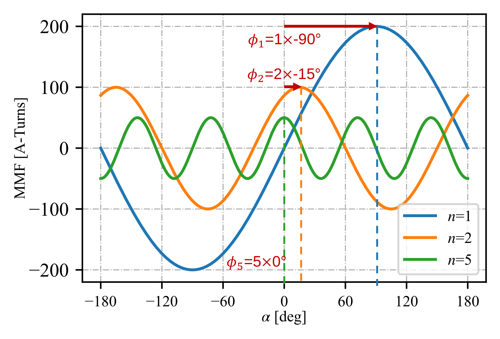
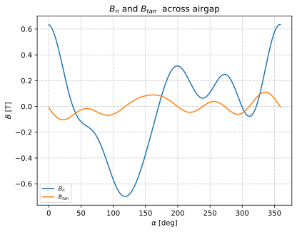

B Field Outer Stator Analyzer
##########################################

This analyzer determines the normal and tangential magnetic fields created in the airgap of an inner rotor, outer stator electric machine
due to stator winding excitation.

Model Background
****************

Typically, normal :math:`B_\text{n}` and tangential :math:`B_\text{tan}` fields created in the airgap of an electric machine are analytically determined
using the following equations:

.. math::

    \hat{B}_\text{n} &= \frac{\mu_0 \hat{A} r_\text{si}}{p \delta}  \\
    \hat{B}_\text{tan} &= -\mu_0 \hat{A}

where :math:`\hat{A}` is the electric loading, :math:`r_{si}` is the inner stator bore radius, :math:`p` is the number of pole pairs of the
winding, and :math:`\delta` is the airgap. The equation for :math:`B_\text{tan}` is found to model the actual stator winding tangential 
fields fairly accurately, provided the iron is not saturated. The equation for :math:`B_{n}` however varies greatly from actual 
radial fields in the airgap, especially as the airgap gets significantly large, even when the machine is operating well within the linear 
region of the magnetic steel. This analyzer improves upon the accuracy of the stator winding radial field equation by considering stator slot 
opening and motor airgap curvature effects. The assumed motor 2D-cross-section for this analyzer is shown below. The direction along which 
:math:`B_\text{n}` and :math:`B_\text{tan}` are taken to be positive has also been indicated in the figure. The analyzer can be extended to machines with 
permanent magnets on the rotor surface by considering an airgap of equivalent remanence.

The assumptions that have gone into the developement of this model are:

1. Electric steel has infinite permeability.
2. Both the rotor and stator have negligible eddy currents.
3. The rotor is non-salient.

This analyzer implements the model(s) provided in the following references:

* G. Bergmann and A. Binder, “Design guidelines of bearingless PMSM with two separate poly-phase windings,” in `XXII International Conference on Electrical Machines (ICEM)`, Lausanne, Switzerland, Sep. 2016`
* Z. Q. Zhu and D. Howe, “Instantaneous magnetic field distribution in brushless permanent magnet DC motors. II. Armature-reaction field,” `IEEE Trans. Magn.`, vol. 29, no. 1

Input from User
*********************************

Users can choose between the following two `problem` classes to interface with this analyzer:

1. `BFieldOuterStatorProblem1`: Users provide winding factors and the problem class handles MMF calculation behind the scenes.  It is assumed that the stator winding is excited with symmetric currents and that winding factors are provided considering the current space vector orientation. 
2. `BFieldOuterStatorProblem2`: Users provide the MMF harmonics acting on the airgap directly as an input. This problem class allows users to consider assymetric or single phase excitation.

Both the winding factors and the MMF harmonics are to be provided 
as complex values representing the magnitude and phase of a Fourier Series. The phase must be provided cosidering the following cosine function: 
:math:`\hat{F}_n \cos(n\alpha + \phi_n)`, where :math:`\hat{F}_n` is the magnitude of the MMF and :math:`\phi_n` is the phase shift at 
harmonic :math:`n`.  A graphical representation of a stator winding MMF harmonics, along with the phase shift at each harmonic is provided 
in the figure below for clarification. The MMF input provided by the user to the analyzer to determine the fields originating from this 
winding should be [:math:`200 \times e^{-j\pi/3}`, :math:`100 \times e^{j\pi/6}`, :math:`50 \times e^{j0}`] A-turns. The harmonics 
corresponding to each MMF component, i.e [1, 2, 5], must also be provided to the analyzer as a separate argument.

The figure below provides the convention used to determine the MMF waveform, and thereafter, the MMF harmonics.

.. figure:: ./Images/MMF_convention.svg
   :alt: Stator_Bn 
   :align: center
   :width: 500 

The required input from the user along with the expected units for both `problem` classes are provided below:

.. csv-table:: `OuterStatorBnfieldProblem1`
   :file: input1_stator_b_field_analyzer.csv
   :widths: 70, 70, 30
   :header-rows: 1
 
.. csv-table:: `OuterStatorBnfieldProblem2`
   :file: input2_stator_b_field_analyzer.csv
   :widths: 70, 70, 30
   :header-rows: 1

Example code initializing the analyzer and problem1 is shown below:

.. code-block:: python

    import numpy as np
    from matplotlib import pyplot as plt
    from eMach.mach_eval.analyzers.electromagnetic.bfield_outer_stator import (
        BFieldOuterStatorAnalyzer,
        BFieldOuterStatorProblem1,
    )

    m = 3  # number of phases
    zq = 20  # number of turns
    Nc = 2  # number of coils per phase
    k_w = np.array(
        [
            0.5 * np.exp(1j * np.pi / 3),
            0.866 * np.exp(-1j * np.pi / 5),
            0,
            0.866 * np.exp(-1j * 0),
            0.5 * np.exp(1j * np.pi / 6),
        ]
    )  # winding factors
    I_hat = 30  # peak current
    n = np.array([1, 2, 3, 4, 5])  # harmonics of interest
    delta_e = 0.002  # airgap
    r_si = 0.025  # inner stator bore radius
    r_rfe = r_si - delta_e  # rotor back iron outer radius
    alpha_so = 0.1  # stator slot opening in radians

    # define problem
    stator_Bn_prob = BFieldOuterStatorProblem1(
        m=m,
        zq=zq,
        Nc=Nc,
        k_w=k_w,
        I_hat=I_hat,
        n=n,
        delta_e=delta_e,
        r_si=r_si,
        r_rfe=r_rfe,
        alpha_so=alpha_so,
    )

    # define analyzer
    stator_B_ana = BFieldOuterStatorAnalyzer()

Output to User
**********************************
The outer stator B field analyzer returns a `OuterStatorBField` object. This object has methods such as `radial` and `tan` which can be 
leverage to determine B fields across the airgap of the machine.

Example code using the analyzer to determine and plot :math:`B_\text{n}` and :math:`B_\text{tan}` at the inner bore of the stator is provide below
(continuation from previous code block):

.. code-block:: python

    B = stator_B_ana.analyze(stator_Bn_prob)
    r = r_si  # radius at which Bn field is required
    # angles at which B field is required
    alpha = np.arange(0, 2 * np.pi, 2 * np.pi / 360)

    fig1 = plt.figure()
    ax = plt.axes()
    fig1.add_axes(ax)
    # plot radial B fields
    ax.plot(alpha, B.radial(alpha=alpha, r=r))
    # plot tangential B fields
    ax.plot(alpha, B.tan(alpha=alpha))

    # sniff test for checking if fields are right. Below value should be very close to 0
    tor = B.radial(alpha=alpha, r=r) * B.tan(alpha=alpha)
    print(np.sum(tor))

    ax.set_xlabel(r"$\alpha$ [deg]")
    ax.set_ylabel("$B$ [T]")
    ax.set_title("$B_n$ and $B_{tan}$ across airgap")
    plt.legend(["$B_n$", "$B_{tan}$"], fontsize=8)
    plt.grid(True, linewidth=0.5, color="#A9A9A9", linestyle="-.")
    plt.show()

Both the `B.radial()` and the  `B.tan()` methods can be passed with an optional `harmonics` argument if the users wishes to obtain fields
of certain select harmonics alone. The below code snippet shows how the code can be modified to obtain the 2nd and 5th harmonics of the
normal magnetic fields:

.. code-block:: python

    B = stator_B_ana.analyze(stator_Bn_prob)
    r = r_si  # radius at which Bn field is required
    # angles at which B field is required
    alpha = np.arange(0, 2 * np.pi, 2 * np.pi / 360)

    fig1 = plt.figure()
    ax = plt.axes()
    fig1.add_axes(ax)
    # plot radial B fields
    ax.plot(alpha * 180 / np.pi, B.radial(alpha=alpha, r=r, harmonics=np.array([2, 5])))

    ax.set_xlabel(r"$\alpha$ [deg]")
    ax.set_ylabel("$B$ [T]")
    ax.set_title("2nd and 5th harmoincs of ${B}_n$")
    plt.grid(True, linewidth=0.5, color="#A9A9A9", linestyle="-.")
    plt.show()

.. figure:: ./Images/stator_bn_2_5.svg
   :alt: B_vs_alpha 
   :align: center
   :width: 500 