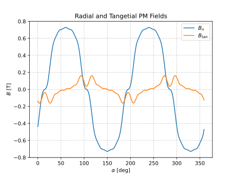

B Field SPM Inner Rotor Analyzer
##########################################

This analyzer determines the normal and tangential magnetic fields created in the airgap of an inner rotor, outer stator electric machine
due to arc permanent magnets.

Model Background
****************

The airgap magnetic field distribution created by permanent magnets is difficult to accurately determine using conventional approaches such as magnetic equivalent circuits and airgap MMF calculations. 
This analyzer provides more accurate calculations by implementing a direct solution to the normal and tangential fields created in the airgap of SPM machines,
originating from the PMs. The model applies to SPMs with arc magnets that are radially or parallelly magnetized, thereby accounting for most
SPM designs. The motor 2D-cross-section assumed by this analyzer is shown below. The direction along which :math:`B_\text{n}` and :math:`B_\text{tan}` are 
taken to be positive has also been indicated in the figure. For improved accuracy with electric machines having slotted stators, Carter's 
coefficient can be employed. 

The assumptions that have gone into the developement of this model are:

1. Electric steel has infinite permeability.
2. Both the rotor and stator have negligible eddy currents.
3. The rotor is non-salient and the stator is slot-less.

This analyzer implements the model(s) provided in the following references:

* G. Bergmann and A. Binder, “Design guidelines of bearingless PMSM with two separate poly-phase windings,” in `XXII International Conference on Electrical Machines (ICEM)`, Lausanne, Switzerland, Sep. 2016
* Z. Q. Zhu, D. Howe, and C. C. Chan, “Improved analytical model for predicting the magnetic field distribution in brushless permanent-magnet machines,” `IEEE Trans. Magn.`, Jan. 2002, doi: 10.1109/20.990112.

Input from User
*********************************

For this analyzer to work, users must provide the below listed information via the `BFieldSPM_InnerRotorProblem` class.

.. csv-table:: `SPM_InnerRotorPMFieldProblem`
   :file: input_rotor_b_field.csv
   :widths: 70, 70, 30
   :header-rows: 1

Example code initializing analyzer and problem is provided below:

.. code-block:: python

    import numpy as np
    from matplotlib import pyplot as plt
    from eMach.mach_eval.analyzers.electromagnetic.bfield_spm_inner_rotor import (
        BFieldSPM_InnerRotorProblem,
        BFieldSPM_InnerRotorAnalyzer,
    )

    alpha_p = 0.8
    theta = np.pi/3
    p=2
    muR = 1.062
    Br = 1.285
    r_fe = 10e-3
    dm = 3e-3
    delta = 2e-3
    mag_dir = "parallel"
    # mag_dir = "radial"
    # define problem
    rotor_B_prob = BFieldSPM_InnerRotorProblem(
        alpha_p=alpha_p,
        theta=theta,
        p=p,
        muR=muR,
        Br=Br,
        r_fe=r_fe,
        dm=dm,
        delta=delta,
        mag_dir=mag_dir,
    )

    # define analyzer
    rotor_B_ana = BFieldSPM_InnerRotorAnalyzer()

Output to User
**********************************
The outer stator B field analyzer returns a `BFieldSPM_InnerRotor` object. This object has methods such as `radial` and `tan` which can be 
used to determine B fields across the airgap of the machine. Users must specify the desired harmonics, orientation of the rotor d-axis, and
the radius at which the fields are to be determined to utilize the methods of `BFieldSPM_InnerRotor`.

Example code using the analyzer to determine and plot :math:`B_\text{n}` and :math:`B_\text{tan}` at the center of the airgap is provided below
(continuation from previous code block):

.. code-block:: python

    B = rotor_B_ana.analyze(rotor_B_prob)
    r = r_fe + dm + delta/2  # radius at which Bn field is required
    # angles at which B field is required
    alpha = np.arange(0, 2 * np.pi, 2 * np.pi / 360)

    fig1 = plt.figure()
    ax = plt.axes()
    fig1.add_axes(ax)
    # plot radial B fields
    ax.plot(alpha * 180 / np.pi, B.radial(alpha=alpha, r=r))
    # plot tangential B fields
    ax.plot(alpha * 180 / np.pi, B.tan(alpha=alpha, r=r))

    ax.set_xlabel(r"$\alpha$ [deg]")
    ax.set_ylabel("$B$ [T]")
    ax.set_title("Radial and Tangetial PM Fields")
    ax.legend(["$B_n$", "$B_{tan}$"])

    # sniff test for checking if fields are right. Printed value should be very close to 0
    tor = B.radial(alpha=alpha, r=r) * B.tan(alpha=alpha, r=r)
    print(np.sum(tor))

    plt.grid(True, linewidth=0.5, color="#A9A9A9", linestyle="-.")
    plt.show()

