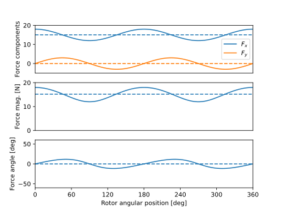

Force Data Analyzer
##########################################

This analyzer determines performance characteristics in bearingless machines. Specifically, the analyzer returns the average of suspension force vector magnitude, the average of force vector's x and y components, and error in force magnitude and angle in bearingless electric machines.

Model Background
****************

Force vector is typically defined in terms of its magnitude :math:`F` and angle :math:`\phi` or in terms of x and y components :math:`F_x` and :math:`F_y`. Using complex number notation, force vector is:

.. math::

    \vec{F} &= F e^{j\phi} = F_x + j F_y\\
    F &= \sqrt{F_x^2 + F_y^2}\\
    \phi &= \text{atan2}(F_y,F_x)\\
where :math:`\text{atan2}()` is the four-quadrant inverse tangent, which determines the angle between positive x-axis and :math:`\vec{F}`.

Given arrays of :math:`F_x` and :math:`F_y` against time or rotor position (or arrays of :math:`F` and :math:`\phi`), the average parameters are calculated:

.. math::

    F_{x,\text{avg}} &= \langle F_x \rangle \\
    F_{y,\text{avg}} &= \langle F_y \rangle \\
    F_{\text{avg}} &= \sqrt{F_{x,\text{avg}}^2 + F_{y,\text{avg}}^2} \\
    \phi_{\text{avg}} &= \text{atan2}(F_{y,\text{avg}},F_{x,\text{avg}}) \\

Using these parameters, error parameters are determined as follows:

.. math::

    E_\text{m} &= \frac{\text{max}(|F - F_{\text{avg}}|)}{F_{\text{avg}}} \\
    E_\text{a} &= \text{max}(|\phi - \phi_{\text{avg}}|) \\

Input from User
*********************************

User is required to provide arrays of x and y components of the force vector to create a `ProcessForceDataProblem` object.

.. csv-table:: `Input to force data problem`
   :file: input_force_data_analyzer.csv
   :widths: 50, 70, 50
   :header-rows: 1

Output to User
**********************************

Force data analyzer returns the following scalar values:

.. csv-table:: `Output of force data analyzer`
   :file: output_force_data_analyzer.csv
   :widths: 50, 70, 50
   :header-rows: 1

Example code using force data analyzer is provided below.

.. code-block:: python

    import numpy as np
    import matplotlib.pyplot as plt
    from eMach.mach_eval.analyzers.force_vector_data import (
        ProcessForceDataProblem,
        ProcessForceDataAnalyzer,
    )

    # define force vector and its x and y components (typically an output of FEA analysis)
    theta = np.linspace(0, 2*np.pi,100)
    force_vector = 15 * np.exp(1j * 0) + 3 * np.exp(1j * 2 * theta)
    Fx = np.real(force_vector) # x-component of force vector
    Fy = np.imag(force_vector) # y-component of force vector

    # define problem
    force_problem = ProcessForceDataProblem(Fx, Fy)
    force_analyzer = ProcessForceDataAnalyzer()

    # analyze the problem
    Fx_avg, Fy_avg, F_abs_avg, Em, Ea = force_analyzer.analyze(force_problem)
    F_ang_avg = np.arctan2(Fy_avg, Fx_avg) / np.pi * 180

    # plot force components, force magnitude, and force angle vs. rotor position
    color1=u'#1f77b4'
    color2=u'#ff7f0e'
    fig,ax=plt.subplots(3,1)

    ax[0].plot(theta * 180 / np.pi, Fx, color=color1)
    ax[0].plot(theta * 180 / np.pi, Fy, color=color2)
    ax[0].plot(theta * 180 / np.pi, Fx_avg* np.ones(len(force_vector)), linestyle='--', color=color1)
    ax[0].plot(theta * 180 / np.pi, Fy_avg* np.ones(len(force_vector)), linestyle='--', color=color2)
    ax[0].set_xticks([])
    ax[0].set_ylabel("Force components")
    ax[0].set_xbound(0, 360)
    ax[0].set_ybound(-5, 20)
    ax[0].legend(['$F_x$','$F_y$'])

    ax[1].plot(theta * 180 / np.pi, abs(force_vector))
    ax[1].plot(theta * 180 / np.pi, F_abs_avg * np.ones(len(force_vector)), linestyle='--', color=color1)
    ax[1].set_xticks([])
    ax[1].set_ylabel("Force mag. [N]")
    ax[1].set_xbound(0, 360)
    ax[1].set_ybound(0, 20)

    ax[2].plot(theta * 180 / np.pi, np.angle(force_vector) / np.pi * 180)
    ax[2].plot(theta * 180 / np.pi, F_ang_avg * np.ones(len(force_vector)), linestyle='--', color=color1)
    ax[2].set_ylabel("Force angle [deg]")
    ax[2].set_xbound(0, 360)
    ax[2].set_ybound(-60, 60)
    ax[2].set_xticks(np.linspace(0, 360, 7))
    ax[2].set_xlabel("Rotor angular position [deg]")

    plt.show()

This code block defines force vector as a function of rotor position and uses force data analyzer to calculate the average force values and error in magnitude and angle.
After running this example code, we expect to get `Fx_avg = 15 N`, `Fy_avg = 0 N`, `F_abs_avg = 15 N`, `Em = 0.2 (20%)`, and `Ea = 11.5 deg`.
The following plot is created, which shows force magnitudes and angles with their average values:

