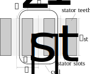

Stator Winding Resistance Analyzer
##########################################

This analyzer calculates stator winding resistance and coil length, considering effects of end windings.

Model Background
****************

This analyzer implements the coil length and resistance calculation approach provided in the following reference:

* N. Bianchi, S. Bolognani, and P. Frare, “Design Criteria for High-Efficiency SPM Synchronous Motors,” in `IEEE Transactions on Energy Conversion`, June 2006.

The calculation approach is summarized below. The following equation is used to calculate stator winding resistance:

.. math::

    R_\text{wdg} &= \frac{z_Q z_C l_\text{coil}}{\sigma_\text{cond} A_\text{cond}}\\

where :math:`z_Q` is the number of turns per coil, :math:`z_C` is the number of series coils per phase, :math:`l_\text{coil}` is the average length of a single coil 
loop, :math:`\sigma_\text{cond}` is the conductor conductivity, and :math:`A_\text{cond}` is the cross-section area. 

Conductor area is found as:

.. math::
    
    A_\text{cond} = \frac{K_\text{Cu}A_\text{slot}}{(n_\text{layers}z_Q)}
    
where :math:`A_\text{slot}` is the stator slot area, :math:`K_\text{Cu}` is the slot fill factor, and :math:`n_\text{layers}` is the number of layers (:math:`n_\text{layers}=1` 
for a single-layer winding and :math:`n_\text{layers} = 2` for a double-layer winding). 

To calculate :math:`l_\text{coil}`, the following coil shape is assumed:

This is the view when one side of the stator is cut along the axial direction and unrolled. Using this diagram, :math:`l_\text{coil}` is calculated as

.. math::

    l_\text{coil} &= 2(l_\text{st} + l_\text{end wdg})\\

where :math:`l_\text{st}` is the length of a coil along the axial length of a motor and :math:`l_\text{end wdg} = l_1 + 2l_2` is the end winding length.

The segments with length :math:`l_1` represent the parts of the end winding that appear only in distributed windings, which are calculated as

.. math::

    l_1 &= \tau_u K_\text{ov} (y-1)\\

where :math:`y` is a coil pitch represented in a number of slots and :math:`K_\text{ov}` is a coil overlength factor. For a concentrated winding, :math:`y = 1`, resulting in 
:math:`l_1 = 0`.

The segments with length :math:`l_2` represent the bent parts of a coil and are calculated as 1/4th of the circle circumference. The diameter of this circle is estimated as 
the average of the stator tooth width :math:`w_\text{st}` and the length between adjacent slots :math:`\tau_u`.

.. math::

    l_2 &= \frac{1}{4} \pi \frac{\tau_u + w_\text{st}}{2}\\

Here, :math:`\tau_u` is calculated as the length of an arc (when a stator is in its normal cylindrical shape) at the median depth of a slot:

.. math::

    \tau_u &= \frac{2 \pi}{Q} (r_\text{si} + d_\text{sp} + \frac{d_\text{st}}{2})\\

where :math:`Q` is the number of stator slots, :math:`r_\text{si}` is the stator inner radius, :math:`d_\text{sp}` is the stator pole thickness, and :math:`d_\text{st}` is the stator 
tooth depth (see :doc:`here <../machines/bspm/bspm_machine>`).

Input from User
*********************************

The user is required to provide the following parameters:

.. csv-table:: `Input to stator winding resistance problem`
   :file: input_stator_wdg_res.csv
   :widths: 50, 70, 50
   :header-rows: 1

For the definition of dimensions, please refer to the figure below:

Output to User
**********************************

The stator winding resistance analyzer returns a dictionary that has the following parameters:

.. csv-table:: `Output of stator winding resistance analyzer`
   :file: output_stator_wdg_res.csv
   :widths: 50, 70, 50
   :header-rows: 1

Here, the total phase winding resistance `R_wdg` is the product of `R_coil` and the number of coils per phase `z_C`.

Example code using the stator winding resistance analyzer is provided below:

.. code-block:: python

    import numpy as np
    from eMach.mach_eval.analyzers.electromagnetic.stator_wdg_res import (
        StatorWindingResistanceProblem,
        StatorWindingResistanceAnalyzer
        )

    # define problem and analyzer
    res_prob = StatorWindingResistanceProblem(
        r_si=34.45/1000,
        d_sp=3.95/1000,
        d_st=20.75/1000,
        w_st=5.38/1000,
        l_st=50/1000,
        Q=24,
        y=9,
        z_Q=16,
        z_C=4,
        Kcu=0.5,
        Kov=1.8,
        sigma_cond=5.7773*1e7,
        slot_area=251*1e-6,
        n_layers=2,
        )
    res_analyzer = StatorWindingResistanceAnalyzer()

    # analyze the problem
    results = res_analyzer.analyze(res_prob)

The output of the code is the dictionary with the following key-value pairs:

.. csv-table:: `Results of stator winding resistance analyzer`
   :file: results_stator_wdg_res.csv
   :widths: 50, 70, 50
   :header-rows: 1