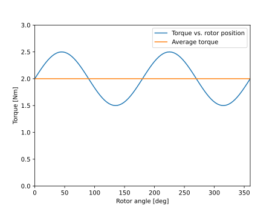

Torque Data Analyzer
##########################################

This analyzer determines average torque and torque ripple created by an electric machine.

Model Background
****************

Given an array of torque values :math:`\tau`, average torque and torque ripple are calculated as follows

.. math::

    \tau_\text{avg} &= \langle \tau \rangle \\
    \tau_\text{ripple} &= \frac{\text{max}(|\tau - \tau_{\text{avg}}|)}{\tau_{\text{avg}}}
where :math:`\tau_\text{avg}` is calculated by taking the average of :math:`\tau`. Torque ripple :math:`\tau_\text{ripple}` indicates the maximum deviation from the average torque as a ratio. It can also be represented as in % when multiplied by 100.

Input from User
*********************************

User is required to provide an array of torque values (against time or rotor position) to create a `ProcessTorqueDataProblem` object.

.. csv-table:: `Input to torque data problem`
   :file: input_torque_data_analyzer.csv
   :widths: 50, 70, 50
   :header-rows: 1

Output to User
**********************************

Torque data analyzer returns the following scalar values:

.. csv-table:: `Output of torque data analyzer`
   :file: output_torque_data_analyzer.csv
   :widths: 50, 70, 50
   :header-rows: 1

Example code using torque data analyzer is provided below. Torque as a function of rotor position is defined, average torque and torque ripple are calculated, and torque and its average are plotted.
Note that, typically, torque array comes directly from FEA analysis results.

.. code-block:: python

    import numpy as np
    import matplotlib.pyplot as plt
    from eMach.mach_eval.analyzers.torque_data import (
        ProcessTorqueDataProblem,
        ProcessTorqueDataAnalyzer,
    )

    # define torque (typically an output of FEA analysis)
    theta = np.linspace(0, 2*np.pi,100)
    torque = 2 + 0.5 * np.sin(2 * theta)

    # define problem
    torque_prob = ProcessTorqueDataProblem(torque)

    # analyze the problem
    torque_avg, torque_ripple = ProcessTorqueDataAnalyzer.analyze(torque_prob)

    # plot torque vs. rotor position and its average
    fig1 = plt.figure()
    ax = plt.axes()
    fig1.add_axes(ax)
    ax.plot(theta * 180 / np.pi, torque)
    ax.plot(theta * 180 / np.pi, torque_avg * np.ones(len(torque)))
    ax.set_xlabel("Rotor angle [deg]")
    ax.set_ylabel("Torque [Nm]")
    ax.set_xbound(0, 360)
    ax.set_ybound(0, 3)
    ax.legend(['Torque vs. rotor position','Average torque'])
    plt.show()

After running this example code, we expect to get `torque_avg = 2 Nm`, `torque_ripple = 0.25 (25%)`, and the following plot:

