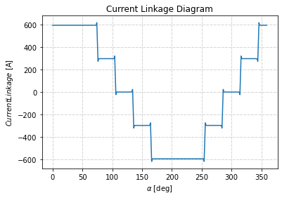
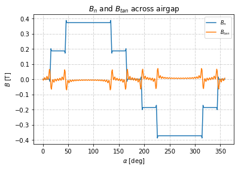

Winding Factors Analyzer
##########################################

This analyzer determines the winding factors of a stator and winding layout for application in calculations of airgap harmonics.

Model Background
****************

Winding factors :math:`\bar{k}_\text{w}` are a way to quantify the effectiveness of a winding and affect various properties of an electric machine including
harmonics present in the airgap field, electric loading, etc. They can be thought of as a proportion of the geometric vector sum of coil side phases 
in a phase winding over the algebraic sum, or mathematically using the following expression usign a single phase:

.. math::

    \bar{k}_\text{w,n} &= \frac{\text{geometric sum}}{\text{algebraic sum}} &= \frac{1}{N} \Sigma_\text{i=1}^N e^{-jn\alpha_i} \\

where :math:`N` is the total number of coil sides, :math:`e^{-jn\alpha_i}` is the geometric representation of the winding factor of each slot, :math:`n` 
is the harmonic index, and :math:`i` is the slot number of the stator. The winding factor for each :math:`n` should be calculated separately. The sum of each 
of these calculations will result in a table of winding factors, all of which must be considered when choosing a design winding layout. This analyzer adds the 
ability to calculate a winding factor based only on a stator geometry and layout. The addition of this analyzer eliminates the need for hand calculations for 
winding factors within the bfield_outer_stator analyzer.

For example, given the layouts in the figure below, winding factors can be calculated for each of the stator geometries.

.. figure:: ./Images/Stator_Diagram.svg
   :alt: Stator Diagram
   :align: center
   :width: 500 

For this stator, the winding factor would be calculated using Phase U (blue) at slots 3-6 (-, out of page) and 9-12 (+, into page). The equation used for this 
calculation would look like the following:

.. math::

    \bar{k}_\text{w,n} &= \frac{\text{geometric sum}}{\text{algebraic sum}} &= \frac{1}{N} \Sigma_\text{i=1}^N e^{-jn\alpha_i} \\

.. math::
    \bar{k}_\text{w,1} &= \frac{-e^{-j1\alpha_3} - e^{-j1\alpha_4} - e^{-j1\alpha_5} + e^{-j1\alpha_6} + e^{-j1\alpha_9} + e^{-j1\alpha_10} 
    + e^{-j1\alpha_11} + e^{-j1\alpha_12}}{8} \\

.. math::
    \bar{k}_\text{w,1} &= \frac{-e^{-j\frac{5\pi}{12}} - e^{-j\frac{7\pi}{12}} - e^{-j\frac{9\pi}{12}} + e^{-j\frac{11\pi}{12}} + e^{-j\frac{17\pi}{12}} 
    + e^{-j\frac{19\pi}{12}} + e^{-j\frac{21\pi}{12}} + e^{-j\frac{23\pi}{12}}}{8} \\

.. math::
    \bar{k}_\text{w,1} = -0.808 - j0.217

The assumptions made going into the development of this model are:

1. Ideal slot fill factors
2. Ideal skew factors

Input from User
***************

Users are utilizing a single `problem` class to interface with this analyzer. This class requires the user to provide the number of harmonnics desired to
be analyzed, the winding layout of the stator, and the location of the first slot. It is assumed that the stator winding is excited with symmetric currents
and that slot fill and skew factors are ideal. The requirements can each be summarized below:

The number of harmonics being tested should be given as an array. The array can be either a specific array of each harmonic (1,2,5,etc.), or it can be a range 
of harmonics of length n (1,2,...,n).

The winding layout should also be given as an array. It should ONLY be provided for a single phase. In the case of this example, it will be using Phase U in the 
stator and winding layout provided. The number of columns in the array should be the number of slots in the stator. The number of rows in the array should be the 
number of layers in the stator. The top layer should be the first row and the bottom layer should be the bottom row. A "-1" should be indicated for a slot with 
windings going into the page, a "0" should be indicated for a slot with no windings present, and a "1" should be indicated for a slot with windings coming out 
of the page. Each winding layer should consume a single row of the winding array. Each slot should consume a single column of the winding array.

The location of the first slot should be indicated in radians from the +x axis. For example, a stator with the first slot at the x-axis will have an 
:math:`\alpha_\text{1}` of 0 radians. The stator geometry in the picture below would have an :math:`\alpha_\text{1}` of :math:`\frac{\pi}{12}` radians.

.. figure:: ./Images/Winding_Diagram.svg
   :alt: Slot_Angles
   :align: center
   :width: 500 

The required input from the user along with the expected units for the `problem` class can be summarized below:

.. csv-table:: `OuterStatorBnfieldProblem1`
   :file: input_winding_factors.csv
   :widths: 70, 70, 30
   :header-rows: 1

Example code initializing the analyzer and problem1 for the stator and winding layout shown is provided below:

.. code-block:: python

    import numpy as np
    from eMach.mach_eval.analyzers.electromagnetic.winding_factors import (
        WindingFactorsProblem,
        WindingFactorsAnalyzer,
        )

    n = np.array([1,2,3,4,5])
    winding_layout = np.array([[1,1,0,0,0,0,-1,-1,0,0,0,0],[0,0,0,0,-1,-1,0,0,0,0,1,1]])
    alpha_1 = 0
    kw_prob = WindingFactorsProblem(n,winding_layout,alpha_1)

    kw_ana = WindingFactorsAnalyzer()

Output to User
***************
The winding factors analyzer returns a `WindingFactors` table. This table has structure that the winding factors are listed for each harmonics_list variable. The 
first value represents the first harmoincs_list variable, the second value represents the second variable, and so on.

Example code using the analyzer to determine the winding factors for each harmonic is provided below (continuation from previous code block):

.. code-block:: python

    k_w = kw_ana.analyze(kw_prob)

The following complex winding factors should result from this stator for harmonics n = 1-5:

.. csv-table:: `WindingFactors`
   :file: output_winding_factors_analyzer.csv
   :widths: 30, 30, 30
   :header-rows: 1

Application to B Field Outer Stator Analyzer
********************************************

In order to plot the current linkage and find the magnetic field of the inner bore of the stator, the winding factor analyzer can be applied to the B Field Outer
Stator Analyzer by adding some code and making some alterations. 

The definitions of the "harmonics of interest" and "winding factors" (variables "k_w" and "n") can be changed and defined below. Note that for plotting the current
linkage, all of the harmonics should be considered. While in reality that is not possible, in practice a number on the scale of :math:`10^3` should be used:

.. code-block:: python

    from eMach.mach_eval.analyzers.electromagnetic.winding_factors import (
    WindingFactorsProblem,
    WindingFactorsAnalyzer,
    )

    n = np.arange(1,1000)
    winding_layout = np.array([[1,1,0,0,0,0,-1,-1,0,0,0,0],[0,0,0,0,-1,-1,0,0,0,0,1,1]])
    alpha_1 = np.pi/12
    kw_prob = WindingFactorsProblem(n,winding_layout,alpha_1)

    kw_ana = WindingFactorsAnalyzer()

    k_w = kw_ana.analyze(kw_prob)

    kw_mag = abs(k_w)
    kw_ang = np.angle(k_w)

This block is redefining the harmonics of interset, providing the winding layout and :math:`\alpha_\text{1}`, and actually calculating the winding factors instead
of having them directly provided. From here, the B Field Outer Stator Analyzer code should be entered as existing. After it is written, the following code should 
be implemented to redefine the problem and plot the current linkage:

.. code-block:: python

    m = 3  # number of phases
    zq = 20  # number of turns
    Nc = 2  # number of coils per phase
    I_hat = 30  # peak current
    delta_e = 0.002  # airgap
    r_si = 0.100  # inner stator bore radius
    r_rfe = r_si - delta_e  # rotor back iron outer radius
    alpha_so = 0.1  # stator slot opening in radians

    from matplotlib import pyplot as plt
    from eMach.mach_eval.analyzers.electromagnetic.bfield_outer_stator import (
        BFieldOuterStatorAnalyzer,
        BFieldOuterStatorProblem1,
    )

    # define problem
    stator_Bn_prob = BFieldOuterStatorProblem1(
        m = m,
        zq = zq,
        Nc = Nc,
        k_w = k_w,
        I_hat = I_hat,
        n = n,
        delta_e = delta_e,
        r_si = r_si,
        r_rfe = r_rfe,
        alpha_so = alpha_so,
    )

    # define analyzer
    stator_B_ana = BFieldOuterStatorAnalyzer()

    B = stator_B_ana.analyze(stator_Bn_prob)
    r = r_si  # radius at which Bn field is required
    # angles at which B field is required
    alpha = np.arange(0, 2 * np.pi, 2 * np.pi / 360)[:,None]

    linkage = B.radial(alpha=alpha, r=r)*delta_e/(4*np.pi*10**(-7))
    fig1 = plt.figure()
    ax = plt.axes()
    fig1.add_axes(ax)
    # plot current linkage
    ax.plot(alpha, linkage)

    ax.set_xlabel(r"$\alpha$ [deg]")
    ax.set_ylabel("$Current Linkage$ [A]")
    ax.set_title("Current Linkage Diagram")
    plt.grid(True, linewidth=0.5, color="#A9A9A9", linestyle="-.")
    plt.show()

This code is taking the MMF function from the B Field Outer Stator Analyzer and calculating the currently linkage directly. Within the B Field Outer Stator Analyzer,
this is then used to calculate the radial and tangential components of the B Field. The applied code should return the following plot for the current linkage of the 
stator and winding layout depicted above:

After plotting the current linkage, we can then use the data to plot the radial and tangential components of the magnetic field in the air gap. The B Field Outer Stator
Analyzer does this using the following code:

.. code-block:: python

    fig2 = plt.figure()
    ax = plt.axes()
    fig2.add_axes(ax)
    # plot radial B fields
    ax.plot(alpha*180/np.pi, B.radial(alpha=alpha, r=r))
    # plot tangential B fields
    ax.plot(alpha*180/np.pi, B.tan(alpha=alpha))

    # sniff test for checking if fields are right. Below value should be very close to 0
    tor = B.radial(alpha=alpha, r=r) * B.tan(alpha=alpha)
    #print(np.sum(tor))

    ax.set_xlabel(r"$\alpha$ [deg]")
    ax.set_ylabel("$B$ [T]")
    ax.set_title("$B_n$ and $B_{tan}$ across airgap")
    plt.legend(["$B_n$", "$B_{tan}$"], fontsize=8)
    plt.grid(True, linewidth=0.5, color="#A9A9A9", linestyle="-.")
    plt.show()

This code will result in the following plots for the magnetic field in the air gap:

