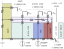
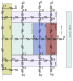

.. _rotor_therm_analyzer:

SPM Rotor Thermal Analyzer
##########################

This analyzer determines the temperature distribution of a surface-mounted permanent magnet (SPM) rotor. 

Model Background
****************

The SPM rotor is modeled using a thermal resistance network as shown in the figure. The implementation of the resistances and nodal locations can be found in the source code of the ``create_resistance_network`` method of ``SPM_RotorThermalAnalyzer``. This analyzer utilizes the :doc:`Thermal Resistance Network Analyzer <../general_analyzers/thermal_res_net_analyzer>` to solve for the temperature distribution in the rotor.

Geometric Dimensions
~~~~~~~~~~~~~~~~~~~~
  
The required geometric dimensions and operating conditions needed to implement this model are shown in the following figure.

.. _therm-geo:
.. figure:: ./Images/Resistance_Network_Dim.svg
   :alt: Trial1 
   :align: center
   :width: 600 

.. _node-loc:

Nodal Locations
~~~~~~~~~~~~~~~

The location of the nodes and resistance network used in this analyzer are highlighted in the following figure. It should be noted that the iron losses are injected at node-3, and the magnet losses are injected at node-5. The convection resistance are shown as any resistance going to node-0. The numbering of the nodes corresponds with the index of the ``T`` vector returned by the analyzer (i.e. the magnet temperature would be provided by ``T[5]``).

Inputs from User
********************************

The ``SPM_RotorThermalAnalyzer`` takes in a ``SPM_RotorThermalProblem`` with inputs listed in the following tables.

.. _mat-dict-therm:
.. csv-table:: Material dictionary for rotor thermal problem -- ``mat_dict``
   :file: inputs_mat_dict_rotor_thermal.csv
   :widths: 70, 70, 30
   :header-rows: 1
   
.. csv-table:: Input losses for rotor thermal problem
   :file: Inputs_losses.csv
   :widths: 70, 70, 30
   :header-rows: 1     
   
.. csv-table:: Input dimensions and operating conditions for rotor thermal problem
   :file: inputs_dimensions_rotor_thermal.csv
   :widths: 70, 70, 30
   :header-rows: 1

   
   
The following code-block demonstrates how to create a ``SPM_RotorThermalProblem`` and ``SPM_RotorThermalAnalyzer``.

.. code-block:: python

    import numpy as np
    from eMach.mach_eval.analyzers.spm.rotor_thermal import SPM_RotorThermalProblem,SPM_RotorThermalAnalyzer
    # Example Machine Dimensions
    r_sh=5E-3 # [m]
    d_m=3E-3 # [m]
    r_ro=12.5E-3 # [m]
    d_ri=r_ro-r_sh - d_m # [m]
    d_sl=1E-3 # [m]
    l_st=50E-3 # [m]
    l_hub=3E-3 # [m]
    r_si=r_ro+d_sl+1E-3 # [m]

    # Define Material Dictionary
    mat_dict= {'shaft_therm_conductivity': 51.9, # W/m-k ,
               'core_therm_conductivity': 28, # W/m-k
               'magnet_therm_conductivity': 8.95, # W/m-k ,
               'sleeve_therm_conductivity': 0.71, # W/m-k,
               'air_therm_conductivity'     :.02624, #W/m-K
               'air_viscosity'              :1.562E-5, #m^2/s
               'air_cp'                     :1, #kJ/kg
               'rotor_hub_therm_conductivity':205.0} #W/m-K}
    # Operating Conditions
    T_ref=25 # [C]
    omega=120E3*2*np.pi/60 # [rad/s]
    losses={'rotor_iron_loss':.001,'magnet_loss':135}
    u_z=0

    prob=SPM_RotorThermalProblem(mat_dict,r_sh,d_ri,r_ro,d_sl,r_si,l_st,l_hub,T_ref,u_z,losses,omega)
    ana=SPM_RotorThermalAnalyzer()

Outputs to User
***********************************
The ``SPM_RotorThermalAnalyzer`` returns back 

* ``T`` a list of temperatures for each node (see this :ref:`figure <node-loc>`) defined by the resistance network.

.. code-block:: python

    T=ana.analyze(prob)

