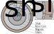

.. _struc_analyzer:

SPM Rotor Structural Analyzer
##############################

This analyzer determines the stress in a surface-mounted permanent magnet (SPM) rotor with a retaining sleeve. 

Model Background
****************

The analyzer models the SPM rotor as a series of concentric cylinders, shown in the figure below. The rotor is assumed to have four regions of varying material: a shaft, rotor back iron, magnets, and a sleeve. The sleeve is designed with an undersized fit in order to provide the compressive force on the rotor. In addition to the compressive force from the sleeve, loading due to thermal expansion is also considered.

.. figure:: ./Images/SleeveOrientation.svg
   :alt: Trial1 
   :align: center
   :width: 300 
   
All materials except for the sleeve are assumed to be isotropic. The sleeve is modeled as anisotropic, which allows consideration of high performance materials such as carbon fiber. The analyzer implements the rotor model developed in `this paper <https://ieeexplore.ieee.org/document/9595523>`_:

* M Johnson, K. Hanson and E. L. Severson, "Normalized Analytical Model of Stresses in a Surface Mounted Permanent Magnet Rotor," `2021 IEEE Energy Conversion Congress and Exposition (ECCE)`, 2021, pp. 3928-3935.

Inputs from User
**********************************

.. _deltaT:
The structural analyzer problem requires a material dictionary (``mat_dict``) and dimensions of the shaft, rotor core, magnet, and sleeve as defined in the diagrams above. The structural analyzer problem also takes in ``deltaT`` which represents the rotor temperature rise to account for thermal expansion. The ``deltaT`` values should be thought of as the temperature rise from rest, so if when the rotor is not in use it rests at 20C, then the temperature rise would be relative to that temperature.

.. _mat-dict:
.. csv-table:: ``mat_dict`` input to SPM structural problem
   :file: inputs_mat_dict.csv
   :widths: 70, 70, 30
   :header-rows: 1

.. csv-table:: Additional inputs for SPM structural problem
   :file: inputs_dimensions.csv
   :widths: 70, 70, 30
   :header-rows: 1

The following code demonstrates how to initialize the ``SPM_RotorStructuralProblem`` and ``SPM_RotorStructuralAnalyzer``. The values used by the ``mat_dict`` are representative of typical values used by this analyzer assuming 1045 carbon steel for the shaft, M19 29-gauge laminated steel for the rotor core, N40 neodymium magnets, and carbon fiber for the sleeve.

.. code-block:: python

    import numpy as np
    from matplotlib import pyplot as plt
    import eMach.mach_eval.analyzers.spm.rotor_structural as sta
    ######################################################
    # Creating the required Material Dictionary 
    ######################################################
    mat_dict = {
        'core_material_density': 7650,  # kg/m3
        'core_youngs_modulus': 185E9,  # Pa
        'core_poission_ratio': .3,
        'alpha_rc' : 1.2E-5,

        'magnet_material_density'    : 7450, # kg/m3
        'magnet_youngs_modulus'      : 160E9, # Pa
        'magnet_poission_ratio'      :.24,
        'alpha_pm'                   :5E-6,

        'sleeve_material_density'    : 1800, # kg/m3
        'sleeve_youngs_th_direction' : 125E9,  #Pa
        'sleeve_youngs_p_direction'  : 8.8E9,  #Pa
        'sleeve_poission_ratio_p'    :.015,
        'sleeve_poission_ratio_tp'   :.28,
        'alpha_sl_t'                :-4.7E-7,
        'alpha_sl_r'                :0.3E-6,

        'sleeve_max_tan_stress': 1950E6,  # Pa
        'sleeve_max_rad_stress': -100E6,  # Pa

        'shaft_material_density': 7870,  # kg/m3
        'shaft_youngs_modulus': 206E9,  # Pa
        'shaft_poission_ratio': .3,  # []
        'alpha_sh' : 1.2E-5
    }
    ######################################################
    #Setting the machine geometry and operating conditions
    ######################################################
    r_sh = 5E-3 # [m]
    d_m = 2E-3 # [m]
    r_ro = 12.5E-3 # [m]
    deltaT = 0 # [K]
    N = 100E3 # [RPM]
    d_sl=1E-3 # [m]
    delta_sl=-2.4E-5 # [m]

    ######################################################
    #Creating problem and analyzer class
    ######################################################
    problem = sta.SPM_RotorStructuralProblem(r_sh, d_m, r_ro, d_sl, delta_sl, deltaT, N,mat_dict)
    analyzer=sta.SPM_RotorStructuralAnalyzer()

Example with No Rotor Sleeve
~~~~~~~~~~~~~~~~~~~~~~~~~~~~
To analyze a rotor with no sleeve, simple set ``d_sl``, ``delta_sl``, and ``deltaT`` to zero when creating the problem as shown in the following code:

.. code-block:: python

    ######################################################
    #Setting the machine geometry and operating conditions
    ######################################################
    r_sh = 5E-3 # [m]
    d_m = 2E-3 # [m]
    r_ro = 12.5E-3 # [m]
    deltaT = 0 # [K]
    N = 50E3 # [RPM]
    d_sl=0 # [m]
    delta_sl=0 # [m]

    ######################################################
    #Creating problem and analyzer class
    ######################################################
    problem = sta.SPM_RotorStructuralProblem(r_sh, d_m, r_ro, d_sl, delta_sl, deltaT, N,mat_dict)
    analyzer=sta.SPM_RotorStructuralAnalyzer()

Outputs to User
***********************************

The SPM structural analyzer returns a list of ``sigma`` objects (referred to as ``sigmas``). Each ``sigma`` object contains the analytic solution for radial and tangential stress in a single rotor components, as follows: 

* ``sigmas[0]``: Shaft
* ``sigmas[1]``: Rotor Core
* ``sigmas[2]``: Magnets
* ``sigmas[3]``: Sleeve

The user can obtain the stress (in units of Pa) at any radius in a rotor component using the ``sigma.radial()`` and ``sigma.tangential()`` methods. For example, ``sigmas[2].radial(r_ro)`` would return the radial stress at the outer edge of the magnets (radius of ``r_ro`` in units of m), and ``sigmas[2].tangential(r_ro)`` would return the tangential stress. Note that the sigma objects determine the stress by solving equation (4) in the supporting `paper <https://ieeexplore.ieee.org/document/9595523>`_.

Example code to calculate the stress distribution in the rotor:

.. code-block:: python

    ######################################################
    #Analyzing Problem
    ######################################################
    sigmas=analyzer.analyze(problem)
    
    ######################################################
    #Creating vectors of radius used for plotting
    ######################################################
    r_vect_sh=np.linspace(r_sh/10000,r_sh,100)
    r_vect_rc=np.linspace(r_sh,r_ro-d_m,100)
    r_vect_pm=np.linspace(r_ro-d_m,r_ro,100)
    r_vect_sl=np.linspace(r_ro,r_ro+d_sl,100)
    
    ######################################################
    #Plotting Stress distribution in rotor
    ######################################################
    fig,ax=plt.subplots(2,1)
    ax[0].plot(r_vect_sh,sigmas[0].radial(r_vect_sh))
    ax[0].plot(r_vect_rc,sigmas[1].radial(r_vect_rc))
    ax[0].plot(r_vect_pm,sigmas[2].radial(r_vect_pm))
    ax[0].plot(r_vect_sl,sigmas[3].radial(r_vect_sl))
    ax[0].set_xticks([])
    ax[0].set_ylabel('Radial Stress [Pa]')
    ax[1].plot(r_vect_sh,sigmas[0].tangential(r_vect_sh))
    ax[1].plot(r_vect_rc,sigmas[1].tangential(r_vect_rc))
    ax[1].plot(r_vect_pm,sigmas[2].tangential(r_vect_pm))
    ax[1].plot(r_vect_sl,sigmas[3].tangential(r_vect_sl))
    ax[1].set_ylabel('Tangential Stress [Pa]')
    ax[1].set_xlabel('Radial Position [m]')
        

.. figure:: ./Images/ExampleStress.svg
   :alt: Trial1 
   :align: center
   :width: 600 
   
Example with No Rotor Sleeve
~~~~~~~~~~~~~~~~~~~~~~~~~~~~

The following code will calculate the stress distribution for a rotor which is not utilizing a rotor sleeve:

.. code-block:: python

    ######################################################
    #Analyzing Problem
    ######################################################
    sigmas=analyzer.analyze(problem)
    
    ######################################################
    #Creating vectors of radius used for plotting
    ######################################################
    r_vect_sh=np.linspace(r_sh/10000,r_sh,100)
    r_vect_rc=np.linspace(r_sh,r_ro-d_m,100)
    r_vect_pm=np.linspace(r_ro-d_m,r_ro,100)
    r_vect_sl=np.linspace(r_ro,r_ro+d_sl,100)
    
    ######################################################
    #Plotting Stress distribution in rotor
    ######################################################
    fig,ax=plt.subplots(2,1)
    ax[0].plot(r_vect_sh,sigmas[0].radial(r_vect_sh))
    ax[0].plot(r_vect_rc,sigmas[1].radial(r_vect_rc))
    ax[0].plot(r_vect_pm,sigmas[2].radial(r_vect_pm))
    ax[0].set_xticks([])
    ax[0].set_ylabel('Radial Stress [Pa]')
    ax[1].plot(r_vect_sh,sigmas[0].tangential(r_vect_sh))
    ax[1].plot(r_vect_rc,sigmas[1].tangential(r_vect_rc))
    ax[1].plot(r_vect_pm,sigmas[2].tangential(r_vect_pm))
    ax[1].set_ylabel('Tangential Stress [Pa]')
    ax[1].set_xlabel('Radial Position [m]')
        

.. figure:: ./Images/ExampleStress_NoSleeve.svg
   :alt: Trial1 
   :align: center
   :width: 600 
