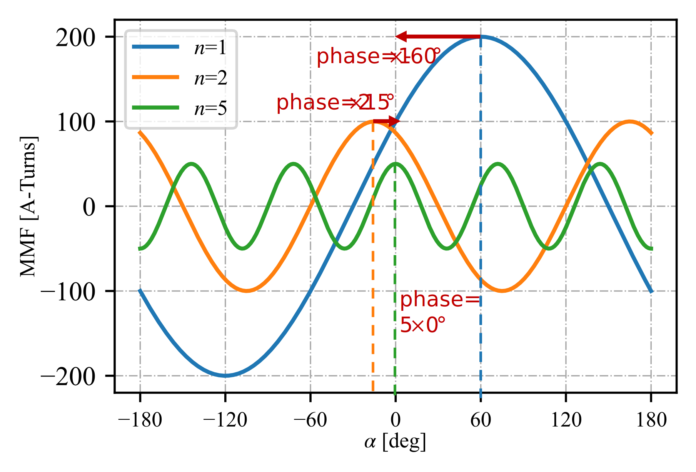
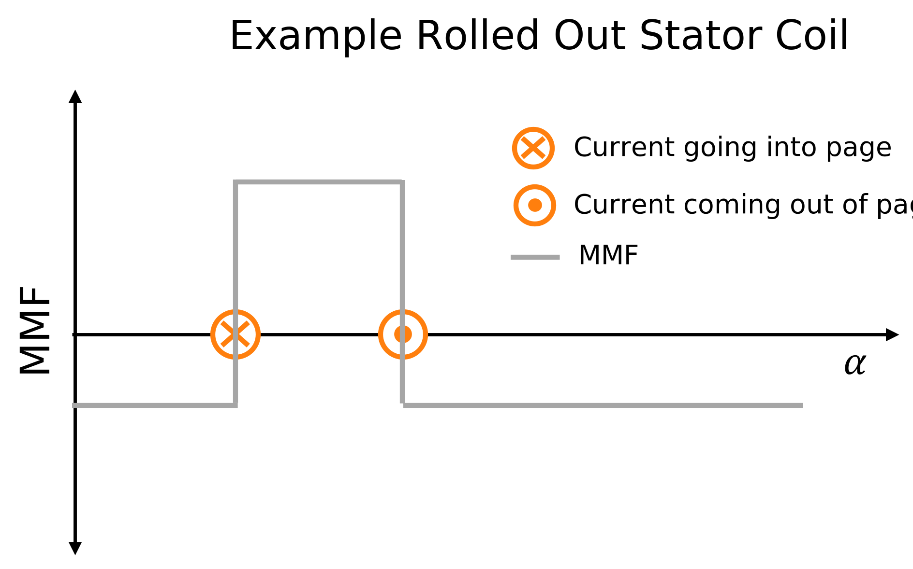

Outer Stator B Field Analyzer
##########################################

This analyzer determines the normal and tangential magnetic fields created in the airgap due to stator winding excitation for an inner rotor, 
outer stator motor using analytical equations.

Model Background
****************

This analyzer aids in the determination of radial and tangetial fields originating in the airgap of an electric machine due to stator winding
excitation. The tangential magnetic fields are provided at the inner bore of the stator, whereas the radial fields can be determined at any
radius within the airgap. This analyzer improves upon the accuracy of typically used stator winding radial field equations by considering 
the impact of stator slot opening and motor airgap curvature on radial fields.  The assumed motor 2D-cross-section for this analyzer is shown 
below. The +ve orientation of :math:`B_n` and :math:`B_{tan}` has also been indicated in the figure below. This analyzer can be extended to 
machines with permanent magnets on the rotor surface by replacing the permanent magnets with an airgap of equivalent remanence.

The assumptions that have gone into the developement of this model are:

1. Electric steel has infinite permeability.
2. Both the rotor and stator have negligible eddy currents.
3. The rotor is non-salient.

This analyzer implements the model(s) provided in the following references:

* G. Bergmann and A. Binder, “Design guidelines of bearingless PMSM with two separate poly-phase windings,” in 2016 XXII International 
  Conference on Electrical Machines (ICEM), Lausanne, Switzerland, Sep. 2016
* Z. Q. Zhu and D. Howe, “Instantaneous magnetic field distribution in brushless permanent magnet DC motors. II. Armature-reaction field,” 
  IEEE Trans. Magn., vol. 29, no. 1

Input from User
*********************************

Users have the option to choose between 2 `problem` classes to interface with this analyzer. The first class requires the user to provide
winding factors and other relavent parameters and handles MMF calculation behind the scenes. With the second class, users are expected to
provide the MMF harmonics directly as an input. Both the winding factors and the MMF harmonics can be provided as a complex values to
represent both phase and magnitude. The phase must be provided relative to a cosine function. Confused about what this means? Hopefully the
following example will clarify the statement. Consider a stator winding with MMF harmonics as shown in the figure below. This particular
winding has harmonics 1, 2, 5. At each harmonic, the phase difference between the peak of the sinuisodal and 0 deg is the phase input that
should be provided to the analyzer. In this case of this particular winding, it would be [:math:`200 \times e^{j\pi/3}`, 
:math:`100 \times e^{-j\pi/6}`, :math:`50 \times e^{j0}`] A-turns, along with the corresponding harmonics provided as a separate argument. 

An astute reader might say, "Wait! This is still not enough information", and they would be right. The final piece of the 
puzzle in using this analyzer is the convention followed in determining MMF from winding layout and current direction. The
below figure provides the expected convention. 

The required input from the user along with the expected units for both `problem` classes are provided below:

.. csv-table:: `OuterStatorBnfieldProblem1`
   :file: input1_stator_b_field_analyzer.csv
   :widths: 70, 70, 30
   :header-rows: 1
 
.. csv-table:: `OuterStatorBnfieldProblem2`
   :file: input2_stator_b_field_analyzer.csv
   :widths: 70, 70, 30
   :header-rows: 1

Example code initializing the analyzer and problem1 is shown below:

.. code-block:: python

    import numpy as np
    from matplotlib import pyplot as plt
    from eMach.mach_eval.analyzers.spm.outer_stator_bfields import (
        OuterStatorBFieldAnalyzer,
        OuterStatorBnfieldProblem1,
    )

    m = 3  # number of phases
    zq = 20  # number of turns
    Nc = 2  # number of coils per phase
    k_w = np.array(
        [
            0.5 * np.exp(1j * np.pi / 3),
            0.866 * np.exp(-1j * np.pi / 5),
            0,
            0.866 * np.exp(-1j * 0),
            0.5 * np.exp(1j * np.pi / 6),
        ]
    )  # winding factors
    I_hat = 30  # peak current
    n = np.array([1, 2, 3, 4, 5])  # harmonics of interest
    delta_e = 0.002  # airgap
    r_si = 0.025  # inner stator bore radius
    r_rfe = r_si - delta_e  # rotor back iron outer radius
    alpha_so = 0.1  # stator slot opening in radians

    # define problem
    stator_Bn_prob = OuterStatorBnfieldProblem1(
        m=m,
        zq=zq,
        Nc=Nc,
        k_w=k_w,
        I_hat=I_hat,
        n=n,
        delta_e=delta_e,
        r_si=r_si,
        r_rfe=r_rfe,
        alpha_so=alpha_so,
    )

    # define analyzer
    stator_B_ana = OuterStatorBFieldAnalyzer()

Output to User
**********************************
The outer stator B field analyzer returns a `OuterStatorBField` object. This object has methods such as `radial` and `tan` which can be 
leverage to determine B fields across the airgap of the machine.

Example code using the analyzer to determine and plot :math:`B_n` and :math:`B_{tan}` at the inner bore of the stator is provide below
(continuation from previous code block):

.. code-block:: python

    B = stator_B_ana.analyze(stator_Bn_prob)
    r = r_si  # radius at which Bn field is required
    # angles at which B field is required
    alpha = np.arange(0, 2 * np.pi, 2 * np.pi / 360)

    fig1 = plt.figure()
    ax = plt.axes()
    fig1.add_axes(ax)
    # plot radial B fields
    ax.plot(alpha, B.radial(alpha=alpha, r=r))
    # plot tangential B fields
    ax.plot(alpha, B.tan(alpha=alpha))

    # sniff test for checking if fields are right. Below value should be very close to 0
    tor = B.radial(alpha=alpha, r=r) * B.tan(alpha=alpha)
    print(np.sum(tor))

    ax.set_xlabel("Theta [deg]")
    ax.set_ylabel("$\hat{B}_n$ [T]")
    ax.set_title("$\hat{B}_n$ across airgap")
    plt.grid(True, linewidth=0.5, color="#A9A9A9", linestyle="-.")
    plt.show()

.. figure:: ./Images/stator_bfields.svg
   :alt: B_vs_alpha 
   :align: center
   :width: 500 