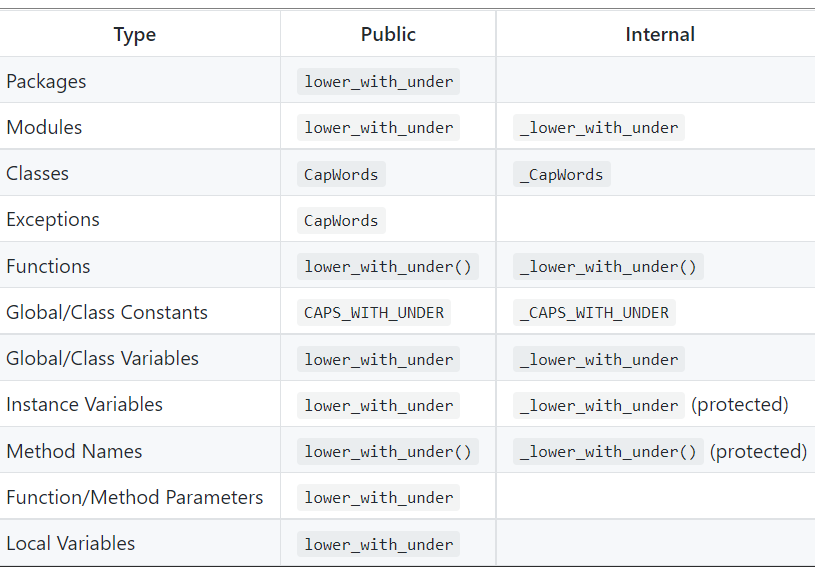

*eMach* Contribution Guidelines
==========================================

This guide is intended to provide guidelines for contributors to *eMach*. All contributors are expected to follow these 
guidelines with exceptions allowed only in cases as specified within the references. 

Code Style
-------------------------------------------

Using a consistent writing style makes shared code more maintainable, useful, and understandable. Contributors to *MachEval*
should follow the `Google Python Style Guidelines for naming <https://google.github.io/styleguide/pyguide.html#s3.16-naming>`_ 
and code documentation. More information on code documentation will be provided in a later section.

A brief summary of guidelines for names in Python includes:

* Avoid using excessively short names: instead, favor full words to convey meaning
* File, function, and variable names: lowercase with words separated by underscores as necessary to improve readability
* Class names: start upper case and then move to camel case
* Keep in mind that certain characters add special functionality: for instance, prepending class methods and variable names with double underscore (__) make them private to that class

Naming guidelines derived from PEP 8, used in the Google format as well, are provided below:

   

Docstrings in Python
--------------------------------------------

A Python docstring is a string literal that occurs as the first statement in a module, function, class, or method definition.
Such a docstring becomes the __doc__ special attribute of that object which can be easily accessed outside the module, 
greatly improving code readability, especially in projects like *MachEval* with multiple module interdependencies.

For the purposes of *MachEval*, contriubutors are expected to follow the `Google Comments and Docstrings guidelines for code
documentation <https://google.github.io/styleguide/pyguide.html#38-comments-and-docstrings>`_. A general guideline which 
helps in greatly improving the usefulness of code documentation is to ensure that docstrings are provided for functions / 
methods and give enough information for users to write a call to any function without having to read the function’s code.

In addition to the benefits mentioned above, the Google docstrings format is also compatible with the Python Documentation 
Generator tool `Sphinx <https://www.sphinx-doc.org/en/master/>`_. As a result, maintaining the above suggested format also 
results directly in the automatic creation of pretty, well indexed documentation of the code base. These documents can be 
hosted online on the Read the Docs platform which supports real-time document updation, or on Github pages via HTML files. It 
should be noted that free document hosting with Read the Docs is supported only for public Git repositories.

Git/GitHub Usage
-------------------------------------------

All code development should occur within the Git version control environment. When code is ready to be contributed back 
to eMach, users should open a Pull Request (PR) on GitHub which explains their contribution.

The branch naming conventions are as follows:

- **User branch:** ``user/my_user_name/foo_bar`` -- "private" development sandbox per user
- **Feature branch:** ``feature/foo_bar`` -- shared feature development

**Hint:** Most development will occur in user branches! If multiple users are working on an eMach feature concurrently, use a feature branch.

Contributors can expect that their user branches will not be commited to by other users---this is "private" space. On the other hand,
feature branches are "public" space and should be treated as such---at any time, another developer can commit new code onto the branch.

For example, if a big feature is being developed by several developers, a common feature branch will be created. Then, developers can
branch from this common feature branch to their own private user branch. Once they are ready to share their code back with the other
developers of the new feature, they can open a PR (or simply merge) their user branch back to the feature branch.

Valid branch name examples: ``user/johndoe/motor_tests``, ``user/janestil2/issue_652``, ``feature/regression_tests``, ``feature/tutorial_femm``

Reviewer Instructions
-------------------------------------------

PRs must be reviewed by official eMach reviewers prior to being merged into the ``develop`` branch. When making a PR, the contributor must identify and request at least one ``Level 1`` reviewer and at least one ``Level 2`` reviewer.
A list of the existing Level 1 and Level 2 reviewers can be found
`here <https://github.com/Severson-Group/eMach/blob/develop/CONTRIBUTING.md>`_.

Instructions for reviewers are now provided. Developers are encouraged to read these instructions to understand how to successfully navigate the review process.

Level 1 Review 
++++++++++++++++++++++++++++++++++++++++++++

A Level 1 reviewer is responsible for verifying that the code works and that both the code and documentation are compliant with the eMach architecture.

In conducting the review, the reviewer should perform the following steps:

1. Pull/fetch the branch being reviewed onto their device and confirm that the code runs and produces the expected results
2. Ensure the code complies with the code guidelines as described `here <https://emach.readthedocs.io/en/latest/code.html>`_ and confirm this in writing in the review summary
3. Ensure the documentation complies with the documentation guidelines as described `here <https://emach.readthedocs.io/en/latest/documentation.html>`_ and confirm this in writing in the review summary
4. Edit the grammar and syntax of the language to ensure that it reads clearly (or request the developer revise)
5. Comment on if the changeset is generally compliant with the eMach architecture
6. Comment on if this review included a review of whether the physics are correct (it's okay if the reviewer did not, just let everyone know)
7. Request changes/give approval to pass to a Level 2 reviewer with a written summary

Reviewers are encouraged to use this template:

.. code-block:: markdown
   
    Thanks for your PR. I have indicated specific change requests on individual files. Here is my level 1 review summary:

    - Does the code run without error and produce the expected result? [Yes or No]
    - Does the code comply with the [code guidlines](https://emach.readthedocs.io/en/latest/code.html)? [Yes or No]
    - Does the code documentation comply with the [documentation guidelines](https://emach.readthedocs.io/en/latest/documentation.html)? [Yes or No]
    - Does the grammar or syntax require further revisions? [Yes or No]
    - Comments on if changeset is compliant with eMach architecture:
    - Comments on if review includes feedback on whether physics are accurate:
    - Is PR approved to Level 2? [Yes or No]

Level 2 Review Requirements
++++++++++++++++++++++++++++++++++++++++++++

A Level 2 reviewer should be someone with a adequte-to-expert understanding of the review material. This reviewer must accomplish the
following tasks:

1. Review the remarks from the Level 1 reviewer and see if anything from this review requires further investigation
2. Review whether the approach, code, and documentation is compliant with the eMach architecture
3. Identify whether the physics are correct (seek outside help as needed, including from the developer)
4. Request changes/give final approval for merge into ``develop``

For both Level 1 and Level 2 reviewers, it should be noted that the aforementioned requirements are meant to serve as a template to be followed and 
with each a summary with comments should be included in the transitions from Level 1 to Level 2 and from Level 2 to merge.

.. code-block:: markdown
   
    Thanks for passing on this PR. I have indicated specific change requests on individual files. Here is my level 2 review summary:

    - Does Level 1 reviewer need to revise their PR? [Yes or No]
    - If yes, please comment on what Level 1 reviewer needs to address: 
    - Does the code and documentation comply with proper guidelines [Yes or No]
    - Are the physics of the PR correct and accurate? [Yes or No]
    - If no, please comment on what further changes are required:
    - Is PR approved? [Yes or No]

Documentation
-------------------------------------------

The ``eMach`` repository uses both ``Sphinx`` and ``Read the Docs`` for generating and hosting documentation online. The link to 
this documentation is provided `here <https://emach.readthedocs.io/en/latest/>`_. This section provides guidelines on practices
contributors are expected to follow to make edits / add to ``eMach`` documentation.

How it Works
++++++++++++++++++++++++++++++++++++++++++++

All of ``eMach``'s documentation resides within the ``docs\source`` folder. This folder contains all the information required by 
``Sphinx`` to generate HTML files in the manner we desire. The workflow currently used in ``eMach`` off-loads the actual generation
of the HTML to the ``Read the Docs`` platform. Contributors, therefore, need to only make changes to the files within the 
``docs\source`` folder and ``Read the Docs`` will take care of actually running ``Sphinx`` and generating the HTML files. A push to the 
``develop`` branch acts as a trigger for ``Read the Docs`` to re-generate HTML files. Therefore, the onus falls on contributors to
ensure everything is in order, documentation wise, prior to merging changes to ``develop``.

Recommended Workflow
++++++++++++++++++++++++++++++++++++++++++++

For small changes involving just edits to exisiting documents and such, contributors can simply push the edits directly to ``develop``. 
For more involved changes, such as adding figures or entirely new files, it is recommended that contributors ensure everything looks
as expected locally before attempting to merge changes. The steps involved in generating HTML files locally are as follows:

1. Ensure the required Python packages are installed (they will be if you followed the pre-reqs document)
2. Navigate to the ``eMach\docs`` folder from within ``Anaconda Prompt``
3. Ensure the ``eMach`` environment is activated (run ``conda activate eMach`` if not certain)
4. Run ``make clean`` followed by ``make html`` command to generate the docs
5. Open up the ``index.html`` file from within ``docs\build\html`` folder and make sure everything is in order

``eMach`` also supports ``Sphinx`` autodocs feature, by which ``Sphinx`` is able to automatically generate documentation
from Python docstrings. Modifications to exisiting Python files will be reflected on ``Read the Docs`` by default. However, if new 
Python files whose docstrings should be included on ``Read the Docs`` are created, contributors will have to run a sequence of 
commands to create the .rst files required to autogenerate the Python docstring HTML file, or manually create / make modifications to 
exisitng .rst files themselves. For more information, please refer to this `link <https://www.sphinx-doc.org/en/master/usage/extensions/autodoc.html>`__.