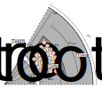
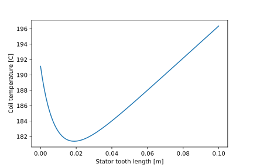

Inner Rotor Stator Thermal Analyzer
###################################

This analyzer is designed to evaluate the temperature distribution in the stator of an inner rotor machine. This analyzer does not utilize the thermal resistance network analyzer, and is a set of stand alone equations for solving the coil temperature.

Model Background
****************

This analyzer is based on the solution of coupled 1-dimension temperature distribution for an inner rotor stator. A detailed description of the math can be found in Chapter III of Martin Johnson's Masters Thesis (TODO link? how do we want handle this?).

Inputs to Stator Thermal Analyzer
*********************************

The required inputs to initializes the ``StatorThermalProblem`` are summarized in the table below and the geometric inputs are visualized in the cross section shown above.

.. csv-table:: Inputs for stator thermal problem 
   :file: inputs_stator_thermal_analyzer.csv
   :widths: 70, 70, 30
   :header-rows: 1

The following code block demonstrates how to initialize the stator thermal problem and analyzer:

.. code-block:: python

    import numpy as np
    import eMach.mach_eval.analyzers.general_analyzers.thermal_stator as sta
    from matplotlib import pyplot as plt
    
    Q= 6 #Number of Slots
    g_sy = 10000 #Volumetric losses in yoke [W/m^3]
    g_th = 50000 #Volumetric losses in tooth [W/m^3]
    w_st = 0.02 #Tooth width [m]
    l_st = 0.05 #Stack length
    l_tooth = 0.05 #Tooth length
    alpha_q = np.pi/Q #slot span [rad]
    r_so = 0.1 #Outer stator radius [m]
    r_sy = .08 #Inner stator yoke radius [m]
    k_ins = 1 #Insulation thermal conductivity [W/m-K]
    w_ins =.001 #Insulation Thickness [m]
    k_fe = 38 #Stator iron thermal conductivity [W/m-k]
    h = 100 #Exterior convection coefficient [W/m^2-k]
    alpha_slot = .7 *alpha_q # back of slot span [rad]
    T_coil_max= 80 #Maximum coil temperature rise [C]
    Q_coil = 40 # Coil losses [W]
    h_slot =0 #Inslot convection coefficient [W/m^2-K]

    problem = sta.StatorThermalProblem(
                g_sy,
                g_th,
                w_st,
                l_st,
                l_tooth,
                alpha_q,
                r_so,
                r_sy,
                k_ins,
                w_ins,
                k_fe,
                h,
                alpha_slot,
                T_coil_max,
                Q_coil,
                h_slot,
            )
    ana = sta.StatorThermalAnalyzer()

Outputs from Stator Thermal Analyzer
************************************

The ``StatorThermalAnalyzer`` outputs a dictionary object with the following keys:

* ``Coil temperature``: Mean temperature of the stator coil
* ``Stator yoke temperature``: Temperature on exterior surface of the stator
* ``Coil losses``: Resistive losses in the coil
* ``Stator yoke losses``: Core losses in the stator yoke
* ``Stator tooth losses``: Core losses in the stator tooth
* ``Valid temperature``: boolean which returns false in the maximum coil temperature is exceeded.

The following code-block demonstrates how the results are returned by the analyzer:

.. code-block:: python

    results = ana.analyze(problem)
    print(results)
    
    {'Coil temperature': 185.9738349818017, 'Stator yoke temperature': 173.95662822498218, 'Coil losses': 40, 'Stator yoke losses': 0.4712388980384692, 'Stator tooth losses': 1.25, 'Valid temperature': False}
    
The analyzer can be utilized in to examine the effect of changing stator geometry as demonstrated in the following code-block. The stator tooth length is swept over ``l_tooth_vect``, and the coil temperature is collected for each entry. The following code will produce the plot shown below, provided the rest of the inputs to the ``StatorThermalProblem`` are used from the previous section.

.. code-block:: python

    l_tooth_vect=np.linspace(0,.1,100)
    T_coil_vect=np.zeros_like(l_tooth_vect)
    for ind,l_tooth in enumerate(l_tooth_vect):
        problem = sta.StatorThermalProblem(
                g_sy,
                g_th,
                w_st,
                l_st,
                l_tooth,
                alpha_q,
                r_so,
                r_sy,
                k_ins,
                w_ins,
                k_fe,
                h,
                alpha_slot,
                T_coil_max,
                Q_coil,
                h_slot,
            )
        ana = sta.StatorThermalAnalyzer()
        results = ana.analyze(problem)  
        T_coil_vect[ind]=results['Coil temperature']

    fig,ax=plt.subplots(1,1)
    ax.plot(l_tooth_vect,T_coil_vect)
    ax.set_xlabel('Stator tooth length [m]')
    ax.set_ylabel('Coil temperature [C]')

