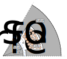
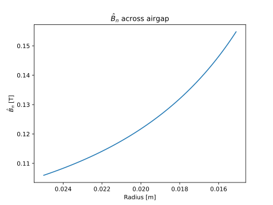

Outer Stator Radial B Field Analyzer
##########################################

This analyzer determines the normal B field created in the airgap due to stator winding excitation for an inner rotor, outer stator motor 
using analytical equations.

Model Background
****************

The analytical determination of normal magnetic fields created in the airgap of a motor due to stator slots typically assumes the B field
magnitude to be constant across the airgap and neglects stator slotting effects. This can lead to results which vary greatly from actual
B fields created in the airgap. The analyzer described in this document addresses both of these issues. The B field created in the airgap
from stator windings is calculated based on the curvature of the machine, slotting effects, as well as the radius at which determination of
normal B field is desired. The analyzer assumes a inner rotor, outer stator electric machine. The stator is similar to typical stators found
in inner rotor machines and the rotor is assumed to be non-salient. The assumed motor layout shown below. This analyzer can be extended to 
machines with permanent magnets on the rotor surface by replacing the permanent magnets with an airgap of equivalent remanence.

The assumptions that have gone into the developement of this model are:

1. Electric steel has infinite permeability.
2. Both the rotor and stator have negligible eddy currents.
3. The rotor is perfectly cylindrical.

The following literature have been referred to in the developement of this analyzer:

* G. Bergmann and A. Binder, “Design guidelines of bearingless PMSM with two separate poly-phase windings,” in 2016 XXII International 
  Conference on Electrical Machines (ICEM), Lausanne, Switzerland, Sep. 2016
* Z. Q. Zhu and D. Howe, “Instantaneous magnetic field distribution in brushless permanent magnet DC motors. II. Armature-reaction field,” 
  IEEE Trans. Magn., vol. 29, no. 1

Inputs from User
*********************************

The required inputs from the user along with the expected units is provided in the table below:
 
.. csv-table:: Outer Stator B Field Required User Inputs
   :file: inputs_stator_bn_field_analyzer.csv
   :widths: 70, 70, 30
   :header-rows: 1

Example code initializing the analyzer and problem with the required inputs is shown below:

.. code-block:: python

    from eMach.mach_eval.analyzers.general.outer_stator_bn_field import (
        OuterStatorBnfieldAnalyzer,
        OuterStatorBnfieldProblem,
    )

    m = 3  # number of phases
    zq = 20  # number of turns
    Nc = 2  # number of coils per phase
    k_w = 0.866  # winding factors
    I_hat = 30  # peak current
    n = 1  # harmonic of interest
    delta_e = 0.005  # airgap
    r_si = 0.03  # inner stator bore radius
    r_rfe = r_si - delta_e  # rotor back iron outer radius
    r = 0.0295  # airgap at which B field is desired
    alpha_so = 0.1  # stator slot opening in radians

    # define problem
    stator_Bn_prob = OuterStatorBnfieldProblem(
        m=m,
        zq=zq,
        Nc=Nc,
        k_w=k_w,
        I_hat=I_hat,
        n=n,
        delta_e=delta_e,
        r_si=r_si,
        r_rfe=r_rfe,
        r=r,
        alpha_so=alpha_so,
    )

    # define analyzer
    stator_Bn_ana = OuterStatorBnfieldAnalyzer()

Outputs to User
**********************************
The outer stator B field analyzer returns the magnitude of the normal B field calculated at radius r for the electric machine provided by 
the user:

Example code using the analyzer to determine and print the normal B field is provided below (follow up after initialization):

.. code-block:: python

    b_field = stator_Bn_ana.analyze(stator_Bn_prob)
    print(b_field)

The analyzer is also flexible enough to evalute the normal B fields originating from multiple harmonics of the stator. An example code showing
how this can be achieved is provided below:

.. code-block:: python

    import numpy as np
    from eMach.mach_eval.analyzers.general.outer_stator_bn_field import (
        OuterStatorBnfieldAnalyzer,
        OuterStatorBnfieldProblem,
    )

    m = 3  # number of phases
    zq = 20  # number of turns
    Nc = 2  # number of coils per phase
    k_w = np.array([0.866, 0.5, 0, 0.5, 0.866])  # winding factors
    I_hat = 30  # peak current
    n = np.array([1, 2, 3, 4, 5])  # harmonics of interest
    delta_e = 0.005  # airgap
    r_si = 0.03  # inner stator bore radius
    r_rfe = r_si - delta_e  # rotor back iron outer radius
    r = 0.0295  # airgap at which B field is desired
    alpha_so = 0.1  # stator slot opening in radians

    # define problem
    stator_Bn_prob = OuterStatorBnfieldProblem(
        m=m,
        zq=zq,
        Nc=Nc,
        k_w=k_w,
        I_hat=I_hat,
        n=n,
        delta_e=delta_e,
        r_si=r_si,
        r_rfe=r_rfe,
        r=r,
        alpha_so=alpha_so,
    )

    # define analyzer
    stator_Bn_ana = OuterStatorBnfieldAnalyzer()

    b_field = stator_Bn_ana.analyze(stator_Bn_prob)
    print(b_field)

Instead of multiple harmonics of a single stator, users could evaluate the normal B field at a single harmonic for multiple designs, or the
the normal B fields at different airgap radii for the same design, or multpile harmonics for multiple designs by passing in the appropriate
numpy arrays. This final example takes an example motor and plots the normal B field as we traverse from the inner stator bore to the outer
rotor radius. Interestingly, the magnitude of normal B field increases as we get closer to the rotor due to the curvature effect.

.. code-block:: python

    import numpy as np
    from matplotlib import pyplot as plt
    from eMach.mach_eval.analyzers.general.outer_stator_bn_field import (
        OuterStatorBnfieldAnalyzer,
        OuterStatorBnfieldProblem,
    )

    m = 3  # number of phases
    zq = 20  # number of turns
    Nc = 2  # number of coils per phase
    k_w = 0.866  # winding factors
    I_hat = 30  # peak current
    n = 1  # harmonics of interest
    delta_e = 0.01  # airgap
    r_si = 0.025  # inner stator bore radius
    r_rfe = r_si - delta_e  # rotor back iron outer radius
    r = np.arange(r_si, r_rfe, -0.0001)  # airgaps at which B field is desired
    alpha_so = 0.1  # stator slot opening in radians

    # define problem
    stator_Bn_prob = OuterStatorBnfieldProblem(
        m=m,
        zq=zq,
        Nc=Nc,
        k_w=k_w,
        I_hat=I_hat,
        n=n,
        delta_e=delta_e,
        r_si=r_si,
        r_rfe=r_rfe,
        r=r,
        alpha_so=alpha_so,
    )

    # define analyzer
    stator_Bn_ana = OuterStatorBnfieldAnalyzer()
    # get radial fields
    b_field = stator_Bn_ana.analyze(stator_Bn_prob)

    # plot radial fields
    fig1 = plt.figure()
    ax = plt.axes()
    fig1.add_axes(ax)
    ax.plot(r, b_field)
    ax.set_xlim(ax.get_xlim()[::-1])  # used to make x axis go from high to low
    ax.set_xlabel("Radius [m]")
    ax.set_ylabel("$\hat{B}_n$ [T]")
    ax.set_title("$\hat{B}_n$ across airgap")
    plt.show()

