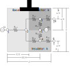
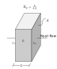
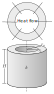
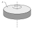
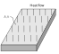
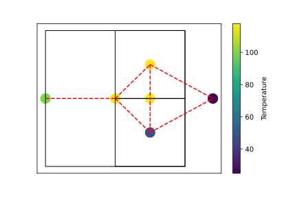

.. _thermal_res_net_analyzer:

Thermal Resistance Network Analyzer
#######################################

This page outlines the use the the thermal resistance network analyzer used by eMach. This analyzer is designed to solve steady state temperature distribution problems. This analyzer is utilized by other analyzers in eMach, to calculate the temperature distribution for certain machine geometries. In this document a simple thermal resistance network is defined to demonstrate how to use this analyzer.

Model Background
****************

Thermal resistance networks are used to reduce the temperature distribution in a system into a set of nodes and thermal resistances. This is analogous to electrical resistance systems, where instead of ``V=IR`` it is ``dT=RQ`` where ``dT`` is the temperature rise, ``R`` is the thermal resistance, and ``Q`` is the heat flow. eMach has several thermal resistances predefined as classes in the the ``thermal_analyzer_base`` module.

This document will utilize the model shown above as an example of how to implement a thermal resistance network in eMach. The model consists of three sections: a base, an conductive material and a insulated material. Two thermal sources are utilized, one at node-1 and one at node-5. There is assumed convection on one end of the object, with a convection coefficient of ``h``, and an assumed depth into the page of ``d``. The following code block demonstrates how these assumptions are implemented:

.. code-block:: python

    import numpy as np
    import scipy.optimize as op
    from matplotlib import pyplot as plt
    from matplotlib.patches import Rectangle
    from eMach.mach_eval.analyzers.thermal_analyzer_base import *
    #################
    #Define Materials
    #################

    k_1=10 #Base Material Thermal Conductivity W/m-K
    k_2=100 #Conductive Material Thermal Conductivity W/m-K
    k_3=.01 #Insulating Material Thermal Conductivity W/m-K

    mat1=Material(k_1)
    mat2=Material(k_2)
    mat3=Material(k_3)
    ##################
    #Define Convection
    ##################
    h=10 #Convection coefficient W/m^2-K
    #################
    #Define Geometry
    #################

    w=0.1 #Width m
    L=.75 #Length m
    d=.1 #Depth m

    L_1=.5*L #Length of base
    L_2=L*3/4 #Length to mid section 2 and 4
    A_1=w*d #Cross sectional area of base
    A_2=w*d/2 #Cross sectional area of section 2 and 3
    A_3=(L-L_1)*d #Cross sectional Area between section 2 and 3

    N_nodes=6 #Number of Nodes

Inputs into Thermal Resistance Network Analyzer
***********************************************

The thermal resistance network analyzer expects a problem class which has the following items:

* ``Resistances``: List of ``Resistance`` objects
* ``Q_dot``: List of heat sources for each node
* ``T_ref``: List of reference nodes and temperatures
* ``N_nodes``: Number of nodes in the system

Each of these inputs will be discussed in detail in the following subsections.

Resistances
~~~~~~~~~~~

The ``Resistance`` protocol is defined in the ``thermal_analyzer_base`` module. Several concrete implementation of this protocol are provided as well. This class is defined to hold the information about a thermal resistance. In the example problem for this document the ``plane_wall`` and ``conv`` resistances are used. 

All Resistance objects take in ``Material``, ``Node_1``, and ``Node_2`` as their first three inputs on initialization. ``Material`` is an object which holds the required material parameters.  ``Node_1`` and ``Node_2`` are ``int`` objects which represent the nodes the resistance is connecting. The following subsections highlight the provided resistance defined in the ``thermal_analyzer_base`` module.
 
plane_wall
----------

The plane wall resistance is initialized by the following: ``plane_wall(Material,Node_1,Node_2,L1,L2,A)``. The required parameters are defined as follows:

* ``L1`` Location of node 1 on first face of plane wall [m]
* ``L2`` Location of node 2 on second face of plane wall [m]
* ``A`` cross sectional area of plane wall [m^2]

Note that the thickness of the plane wall is ``L2-L1``, so ``L2`` should be defined as the larger value of the two nodes.

cylind_wall
-----------

   
The cylindrical wall resistance is initialized by the following code:
``cylind_wall(Material,Node_1,Node_2,R_1,R_2,H)``. The required parameters are defined as follows:

* ``R_1`` radial location of node 1 [m]
* ``R_2`` radial location of node 2 [m]
* ``H`` Height of cylindrical wall [m]

air_gap_conv
------------
.. figure:: ./Images/AirGapConv.svg
   :alt: Trial1 
   :align: center
   :width: 200 
   
The air gap convection resistance is initialized by the following code:
``air_gap_conv(Material,Node_1,Node_2,omega,R_r,R_s,u_z,A)``. The required parameters are defined as follows:

* ``omega`` rotational speed [rad/s]
* ``R_r`` Outer radius of rotor [m]
* ``R_s`` Inner radius of stator [m]
* ``u_z`` Axial airflow velocity [m/s]
* ``A`` Surface area of rotor [m^2]

The calculations in this class are based on the following paper:

* D. A. Howey, P. R. N. Childs and A. S. Holmes, "Air-Gap Convection in Rotating Electrical Machines," in `IEEE Transactions on Industrial Electronics`, vol. 59, no. 3, pp. 1367-1375, March 2012.

hub_conv
------------

   
The rotor hub convection resistance is initialized by the following code:
``hub_conv(Material,Node_1,Node_2,omega,A)``. The required parameters are defined as follows:

* ``omega`` rotational speed [rad/s]
* ``A`` Surface area of rotor [m^2]

The calculations in this class are based on the following paper:

* D. A. Howey, P. R. N. Childs and A. S. Holmes, "Air-Gap Convection in Rotating Electrical Machines," in `IEEE Transactions on Industrial Electronics`, vol. 59, no. 3, pp. 1367-1375, March 2012.

shaft_conv
------------
.. figure:: ./Images/ShaftConv.svg
   :alt: Trial1 
   :align: center
   :width: 200 
   
The shaft convection resistance is initialized by the following code:
``shaft_conv(Material,Node_1,Node_2,omega,R,A,u_z)``. The required parameters are defined as follows:

* ``omega`` rotational speed [rad/s]
* ``R`` Outer radius of shaft [m]
* ``A`` Surface area of rotor [m^2]
* ``u_z`` Axial airflow velocity [m/s]

The calculations in this class are based on the following paper:

* D. A. Howey, P. R. N. Childs and A. S. Holmes, "Air-Gap Convection in Rotating Electrical Machines," in `IEEE Transactions on Industrial Electronics`, vol. 59, no. 3, pp. 1367-1375, March 2012.

conv
----

   
A general convection resistance is initialized by the following code:
``conv(Material,Node_1,Node_2,h,A)``. The required parameters are defined as follows:

* ``h`` Convection coefficient [W/m^2-K]
* ``A`` Surface area [m^2]

Example Resistance Network
--------------------------

The following code-block demonstrate how to generate the list of ``Resistance`` objects for this example:

.. code-block:: python

    ###################
    #Define Resistances
    ###################
    Resistances = []
    ##############
    # Path 0
    ##############
    Descr = "R_1,2"
    Resistances.append(plane_wall(mat1, 1, 2, 0, L_1, A_1))
    Resistances[0].Descr = Descr
    ##############
    # Path 1
    ##############
    Descr = "R_2,3"
    Resistances.append(plane_wall(mat2, 2, 3, L_1, L_2, A_2))
    Resistances[1].Descr = Descr

    ##############
    # Path 2
    ##############
    Descr = "R_2,4"
    Resistances.append(plane_wall(mat3, 2, 4, L_1, L_2, A_2))
    Resistances[2].Descr = Descr

    ##############
    # Path 3
    ##############
    Descr = "R_3,5"
    Resistances.append(plane_wall(mat2, 3, 5, 0, w/4, A_3))
    Resistances[3].Descr = Descr

    ##############
    # Path 4
    ##############
    Descr = "R_4,5"
    Resistances.append(plane_wall(mat3, 4, 5, 0, w/4, A_3))
    Resistances[4].Descr = Descr

    ##############
    # Path 5
    ##############
    Descr = "R_3,0"
    Resistances.append(conv(None, 3, 0, h, A_2))
    Resistances[5].Descr = Descr

    ##############
    # Path 6
    ##############
    Descr = "R_4,0"
    Resistances.append(conv(None, 4, 0, h, A_2))
    Resistances[6].Descr = Descr
    
Q_dot
~~~~~

The ``Q_dot`` input is a list of the thermal sources at each node. In this problem, there are two thermal sources, one at node-1 and one at node-5. The following code-block creates a list of 0's of length ``N_nodes``, and then sets the sources at nodes 1 and 5.

.. code-block:: python

    ####################
    #Define Heat Sources
    ####################
    Q_dot=[0,]*N_nodes
    Q_dot[1]=10
    Q_dot[5]=10

T_ref
~~~~~

The ``T_ref`` input to the problem class expects a list of ``[[ref_node_1,ref_temp_1],[ref_node_2,ref_temp_2]..]`` where each pair represents a fixed temperature at a reference node. For this example, only one reference temperatures is used, so the ``T_ref`` object would look as follows:

.. code-block:: python

    ######################
    #Define Reference Temps
    ######################
    ref_node=0
    ref_temp=25
    T_ref=[[ref_node,ref_temp],]
    
N_nodes
~~~~~~~

``N_nodes`` is an integer input which represents the number of nodes in the system.

Outputs from Thermal Resistance Network Analyzer
************************************************

The ``ThermalAnalyzer`` takes in the a ``ThermalProblem`` and returns back the temperature distribution as a list of temperatures for every node defined by the resistance network. The following code demonstrates how to implement and then solve the example resistance network using the analyzer.

.. code-block:: python

    ############################
    #Create Problem and Analzyer
    ############################
    prob=ThermalProblem(Resistances,Q_dot,T_ref,N_nodes)
    ana=ThermalAnalyzer()

    ############################
    #Solve Problem
    ############################
    T=ana.analyze(prob)
    
The following code will produce a plot of the temperature distribution for the example resistance network as shown.

.. code-block:: python

    x=[L*1.2,0,L_1,L_2,L_2,L_2]
    y=[0,0,0,w/4,-w/4,0]
    fig,ax=plt.subplots(1,1)
    c1=ax.scatter(x,y,c=T,s=200)
    h=fig.colorbar(c1,label='Temperature')
    # Create a Rectangle patch
    rect = Rectangle((0,-w/2),L,w,linewidth=1,edgecolor='k',facecolor='none')
    # Add the patch to the Axes
    ax.add_patch(rect)
    # Create a Rectangle patch
    rect = Rectangle((L_1,0),L-L_1,w/2,linewidth=1,edgecolor='k',facecolor='none')
    # Add the patch to the Axes
    ax.add_patch(rect)
    # Create a Rectangle patch
    rect = Rectangle((L_1,-w/2),L-L_1,w/2,linewidth=1,edgecolor='k',facecolor='none')
    # Add the patch to the Axes
    ax.add_patch(rect)
    ax.plot([x[1],x[2]],[y[1],y[2]],'r--')
    ax.plot([x[2],x[3]],[y[2],y[3]],'r--')
    ax.plot([x[2],x[3]],[y[2],y[4]],'r--')
    ax.plot([x[3],x[5]],[y[3],y[5]],'r--')
    ax.plot([x[4],x[5]],[y[4],y[5]],'r--')
    ax.plot([x[3],x[0]],[y[3],y[0]],'r--')
    ax.plot([x[4],x[0]],[y[4],y[0]],'r--')
    ax.set_yticks([])
    ax.set_xticks([])

