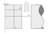
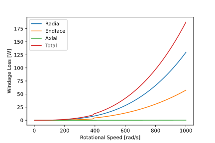

Windage Loss Analyzer
#####################

This analyzer is utilized to calculate the windage loss generated by an inner rotor machine.

Model Background
****************

This analyzer utilizes equations for calculating windage loss on a rotor derived by the following papers:

* J. An, A. Binder and C. R. Sabirin, "Loss measurement of a 30 kW high speed permanent magnet synchronous machine with active magnetic bearings," `2013 International Conference on Electrical Machines and Systems` (ICEMS), 2013, pp. 905-910.
* B. Riemer, M. Leßmann and K. Hameyer, "Rotor design of a high-speed Permanent Magnet Synchronous Machine rating 100,000 rpm at 10kW," `2010 IEEE Energy Conversion Congress and Exposition`, Atlanta, GA, 2010, pp. 3978-3985.

Inputs to Windage Loss Analyzer
*********************************

The presented model for windage loss utilizes the geometry shown in the figure above. Axial airflow is assumed to be flowing through the airgap as shown. The analyzer calculates three windage loss components: radial, end face, and axial. The radial loss corresponds with windage losses generated by the radial surface of the rotor in the airgap. The end face losses occur on the upper and lower surface of the rotor. The axial loss component is an additional loss which occurs in the machine due to axial airflow through the machine. The total windage loss is the sum of these losses. The following inputs are required to define the windage loss analyzer:
 
.. csv-table:: Inputs for stator thermal problem 
   :file: inputs_windage_loss_analyzer.csv
   :widths: 70, 70, 30
   :header-rows: 1

The following code-block demonstrates how to initialize the windage loss analyzer and problem:

.. code-block:: python

    import numpy as np
    import eMach.mach_eval.analyzers.general_analyzers.windage_loss_analyzer as wla
    from matplotlib import pyplot as plt

    Omega=1000
    R_ro=.01
    stack_length=.05
    R_st=.105
    u_z=.01
    TEMPERATURE_OF_AIR=25

    problem=wla.WindageLossProblem(Omega,R_ro,stack_length,R_st,u_z,TEMPERATURE_OF_AIR)
    ana=wla.WindageLossAnalyzer

Outputs from Windage Loss Analyzer
**********************************

The windage loss analyzer returns back the a list of the windage loss components calculated ``[windage_loss_radial,windage_loss_endface,windage_loss_axial]`` in Watts. The following code-block demonstrates how to utilize the windage loss analyzer. The following plot is generated by varying the rotational speed ``Omega`` as in input to the problem, and plotting the windage loss.

.. code-block:: python

    results=ana.analyze(problem)
    print(results)

    Omega_vect=np.linspace(1,1000,100)
    loss_vect=np.zeros([3,100])
    total_loss_vect=np.zeros_like(Omega_vect)
    for ind,Omega in enumerate(Omega_vect):
        problem=wla.WindageLossProblem(Omega,R_ro,stack_length,R_st,u_z,TEMPERATURE_OF_AIR)
        loss=ana.analyze(problem)
        loss_vect[:,ind]=loss
        total_loss_vect[ind]=sum(loss)
    fig,ax=plt.subplots(1,1)   
    ax.plot(Omega_vect,loss_vect.T)
    ax.plot(Omega_vect,total_loss_vect)
    ax.legend(['Radial','Endface','Axial','Total'])
    ax.set_xlabel('Rotational Speed [rad/s]')
    ax.set_ylabel('Windage Loss [W]')
    
    
