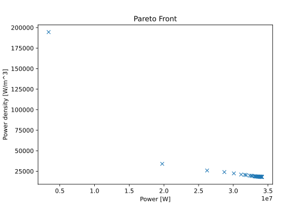

Analytical Machine Optimization Tutorial
========================================

* **Goal:** Understand Analysis steps, and integration of ``mach_eval`` and ``mach_opt``
* **Complexity** 3/5
* **Estimated Time** 30 min

This tutorial will introduce the ``AnalysisStep`` protocols and demonstrate how the functionality of ``mach_eval`` can be integrated with ``mach_opt``. A machine topology will be optimized to maximize both the output power and power density, while keeping the tip speed and the stator temperature within the given limits. By the end of this tutorial you will be able to:

* Create ``AnalysisSteps`` to define complex analysis steps in the evaluation process
* Integrate ``mach_eval`` class with the optimization tools of ``mach_opt``

The classes used in the example represent a simplified machine topology and evaluation process which is not accurate to real physics. The purpose of this document is to demonstrate how these classes are created and interact.

Tutorial Requirements 
---------------------

This tutorial requires that ``eMach`` and the associated packages are installed:

#. All required Python packages are installed on system. (See :doc:`Pre-requisites <../../pre_reqs>`)
#. ``eMach`` installed as a sub-module in a root folder of a git repository (See :doc:`Rectangle Example <../rectangle_tutorial/index>`)
#. Completion of the :doc:`Rectangle Tutorial <../rectangle_tutorial/index>` and :doc:`Analytical Machine Design Tutorial <../analytical_machine_des_tutorial/index>`.

Step 1: Open Previous Tutorial File
------------------------------------------

This tutorial will use the classes created in the :doc:`analytical machine design tutorial <../analytical_machine_des_tutorial/index>`. The instructions are written so that tutorial participants modify the previously-created ``mach_eval_tutorial.py``.

Step 2: Update Import Statements
------------------------------------------

At the top of the ``mach_eval_tutorial.py`` file, add the following import statements to add the required modules for this tutorial. 

.. code-block:: python
	
    from eMach import mach_opt as mo
    import pygmo as pg
	
Step 3: Add Constraints Step
------------------------------------------
The following class defines an additional ``EvaluationStep`` introduced in the :doc:`analytical machine design tutorial <../analytical_machine_des_tutorial/index>`. This step is designed to check if the tip speed of the rotor exceeds an upper bound. This class introduces a new tool: the ``mo.InvalidDesign`` exception. This is an exception which is defined in the ``mach_opt`` repository, which when raised will exit the evaluation process in the ``fitness`` method of the ``MachineDesignProblem`` class and return back large objective values. This effectively acts as a death penalty constraint for the optimization, and allows for designs to be discarded during the evaluation process. Copy this code into the ``mach_eval_tutorial.py`` file near the other ``EvalutationSteps``. 

.. code-block:: python

    class ConstraintCheckStep(me.EvaluationStep):
        def __init__(self,v_tip_limit):
            self.v_tip_limit=v_tip_limit
        def step(self,state_in):
            r_ro=state_in.design.machine.r_ro
            Omega=state_in.design.settings.Omega
            v_tip=r_ro*Omega
            if v_tip > self.v_tip_limit:
                raise mo.InvalidDesign(message='Excessive tip speed')
            state_out=deepcopy(state_in)
            state_out.conditions.v_tip=v_tip
            results=v_tip
            return [results,state_out]

Step 4: Define AnalysisStep
-----------------------------

The ``AnalysisStep`` class of ``mach_eval`` is a concrete class which implements the ``EvaluationStep`` protocol (see :ref:`here <analysis-step>`). This class defines three protocols it must take in on initialization:

* ``ProblemDefinition``
* ``Analyzer``
* ``Post Analyzer``

The example provided in this step will demonstrate the functionality of these protocols and their role in defining the ``AnalysisStep`` functionality for a simple thermal analysis.

Step 4.1: ProblemDefinition
~~~~~~~~~~~~~~~~~~~~~~~~~~~~

The ``ProblemDefinition`` protocol is designed to convert the input state the ``AnalysisStep`` receives into a ``problem`` class which the ``Analyzer`` can use. The purpose for this class is to allow for ``Analyzers`` to be written generally, not in respect to a specific optimization. By parsing the ``state`` object into a set ``problem``, the ``Analyzer`` does not need to interact with any superfluous information contained in the ``state`` object.

In this example, the ``problem`` defined by the ``Analyzer`` (discussed in the following sub-step) is given in the following code block. The ``problem`` class effectively acts as a container of relevant information for the ``Analyzer``. Copy this code into the ``mach_eval_tutorial.py`` file near the other class definitions. 

.. code-block:: python

    class ThermalProblem():
        def __init__(self,losses,A_so,h,T_out):
            self.losses=losses,
            self.A_so=A_so
            self.h=h
            self.T_out=T_out

The implementation of the ``ProblemDefinition`` protocol is provided in the following code block. This protocol requires that the developer implement a single method, ``get_problem``, which converts the input ``state`` to the ``problem`` object. Copy this code into the ``mach_eval_tutorial.py`` file under the ``ThermalProblem`` class. 

.. code-block:: python

    class ThermalProblemDefinition(me.ProblemDefinition):
        def __init__(self,h,T_out):
            self.h=h
            self.T_out=T_out
        def get_problem(self,state:'me.State')->'me.Problem':
            losses=state.conditions.losses 
            r_so=state.design.machine.r_so 
            l_st=state.design.machine.l_st
            A_so=2*np.pi*r_so*l_st 
            
            problem=ThermalProblem(losses,A_so,self.h,self.T_out)
            return problem
			
Step 4.2: Analyzer
~~~~~~~~~~~~~~~~~~~~~~~~~~~~

As mentioned in the previous sub-step, the ``Analyzer`` protocol is designed to allow for modular, generalized, and reusable analysis code that is capable of studying aspects of multiple machine types. It usually makes sense to create an ``Analyzer`` for code that is lengthy enough to warrant the added complexity over the ``EvaluationStep`` protocol and/or is likely to be useful to other developers to study multiple machine types. `mach_cad` comes with many `Analyzer` classes already provided (browse the `Analyzers` section of the table of contents). Developers are encouraged to contribute their analyzers to this collection for the benefit of others.

The only required method of the ``Analyzer`` protocol is the ``analyze`` method, which takes in a ``problem`` object and returns results of the analysis. Though not explicitly checked, each analyzer will have a problem class it is associated with, which defines the information that the analyzer needs. The example analyzer for this tutorial is provided in the following code block. The class checks to see if the temperature rise of the stator will exceed the maximum allowable temperature. If this occurs, the analyzer raises the ``mo.InvalidDesign`` exception. Paste this code under the ``ThermalProblemDefinition`` class in the ``mach_eval_tutorial.py`` file.

.. code-block:: python

    class ThermalAnalyzer(me.Analyzer):
        def __init__(self,T_limit):
            self.T_limit=T_limit
        def analyze(self,problem:'me.Problem'):
            A_so=problem.A_so
            h=problem.h
            losses=problem.losses
            T_out=problem.T_out
            T_stator=(1/(A_so*h))*np.sum(losses)+T_out
            
            if T_stator>self.T_limit:
                raise mo.InvalidDesign(message='Excessive Temperature')
            else:
                return T_stator

Step 4.3: PostAnalyzer
~~~~~~~~~~~~~~~~~~~~~~~~~~~~

The ``PostAnalyzer`` class can be thought of as the inverse of the ``ProblemDefinition`` class: it converts the results of the analysis step back into a ``state`` object. The ``PostAnalyzer`` protocol requires that this class implement a ``get_next_state`` method to receive results from the ``Analyzer`` and the input state passed to the ``ProblemDefinition`` and return a new state object. The implementation of the ``PostAnalyzer`` should utilize the ``deepcopy`` function as described in the :doc:`previous tutorial <../analytical_machine_des_tutorial/index>`. Copy the following code block into the ``mach_eval_tutorial.py`` file under the ``ThermalAnalyzer`` class.

.. code-block:: python

    class ThermalPostAnalyzer(me.PostAnalyzer):
        def get_next_state(self,results,stateIn:'me.State')->'me.State':
            stateOut=deepcopy(stateIn)
            stateOut.conditions.T_stator=results
            return stateOut

Step 5: Create DesignSpace 
--------------------------------

In this step, a ``DesignSpace`` class is created to configure the optimization workflow. The optimization is intended to maximize power and power density. The example code demonstrates how the results returned by the ``MachineEvaluator`` of ``mach_eval`` can be utilized by the ``DesignSpace`` class of the ``mach_opt`` module. 

Copy the following code into the ``mach_eval_tutorial.py`` file to define the ``DesignSpace`` for this example.

.. code-block:: python

    class ExampleMachineDesignSpace(mo.DesignSpace):
        """Class defines objectives of machine optimization"""

        def __init__(self,bounds,n_obj):
            self._n_obj=n_obj
            self._bounds=bounds
            
        def get_objectives(self, full_results) -> tuple:
            last_results=full_results[-1]
            last_state=last_results[-1]
            power=last_state.conditions.Power
            r_so=last_state.design.machine.r_so
            l_st=last_state.design.machine.l_st
            V_s=np.pi*r_so**2*l_st
            power_den=power/V_s
            return (-power,-power_den)
        
        def check_constraints(self, full_results) -> bool:
            return True
        
        @property
        def n_obj(self) -> int:
            return self._n_obj
        
        @property
        def bounds(self) -> tuple:
            return self._bounds

.. note:: The results of the ``MachineEvaluator`` are an ordered list of [input_state, evaluation results, output_state] for each ``EvaluationStep`` which is injected. The ``DesignSpace`` class often needs only to access the last state of the evaluation process. The code ``last_results=full_results[-1]`` and ``last_state=last_results[-1]`` provide the user easy access to the final state of the evaluation process.

Once again, a dummy ``DataHandler`` is defined for this tutorial. Copy the following code into the ``mach_eval_tutorial.py`` file.
			
.. code-block:: python
		
    class DataHandler:
        def save_to_archive(self, x, design, full_results, objs):
            """Unimplemented data handler"""
            pass
        def save_designer(self, designer):
            pass      

Step 6: Run the optimization
--------------------------------

In order to run the optimization, the new classes must be initialized, and the evaluator must be modified to include the new steps. Modify the code at the bottom of the ``mach_eval_tutorial.py`` file to include the following when defining the ``MachineEvaluator``. Note that the new steps are injected into the list of ``EvalutationSteps``

.. code-block:: python

    v_tip_limit=200
    const_step=ConstraintCheckStep(v_tip_limit)
    h=10
    T_out=25
    T_limit=50
    problem_def=ThermalProblemDefinition(h, T_out)
    analyzer=ThermalAnalyzer(T_limit)
    post_analyzer=ThermalPostAnalyzer()
    thermal_step=me.AnalysisStep(problem_def, analyzer, post_analyzer)
    evaluator=me.MachineEvaluator([const_step,power_step,loss_step,thermal_step]) 
	
The following code initializes the ``DataHandler`` and ``DesignSpace`` classes, and then injects them into the ``DesignProblem`` of the ``mach_opt`` module. The ``DesignProblem`` class is then used to create the optimization and the results are plotted.

.. code-block:: python

    dh=DataHandler()

    bounds=([0.001,0,0,0,1,0.1,0,0],
            [1,1,6,1,10,1,100,100])
    n_obj=2
    ## Inject bounds and number of objectives into DesignSpace
    ds=ExampleMachineDesignSpace(bounds,n_obj)

    #Create Machine Design Problem
    machDesProb=mo.DesignProblem(des,evaluator,ds,dh)

    #Run Optimization
    opt=mo.DesignOptimizationMOEAD(machDesProb)
    pop_size=100
    pop=opt.initial_pop(pop_size)
    pop=opt.run_optimization(pop,40)
    #Plot Pareto front
    fig1=plt.figure()   
    plot1=plt.axes()
    fig1.add_axes(plot1)
    fits, vectors = pop.get_f(), pop.get_x()
    ndf, dl, dc, ndr = pg.fast_non_dominated_sorting(fits) 
    plot1.plot(-fits[ndf[0],0],-fits[ndf[0],1],'x')
    plot1.set_xlabel('Power [W]')
    plot1.set_ylabel('Power density [W/m^3]')
    plot1.set_title('Pareto Front')
    plt.savefig('ParetoFront.svg')

If the code was correctly implemented, the results of the optimization should look similar to the following plot.

Conclusion
----------

You have successfully completed this tutorial to demonstrate the full functionality of the ``mach_eval`` module and its connection to the optimization framework of ``mach_opt``. You are now ready to create your own optimization workflows using ``eMach``.
