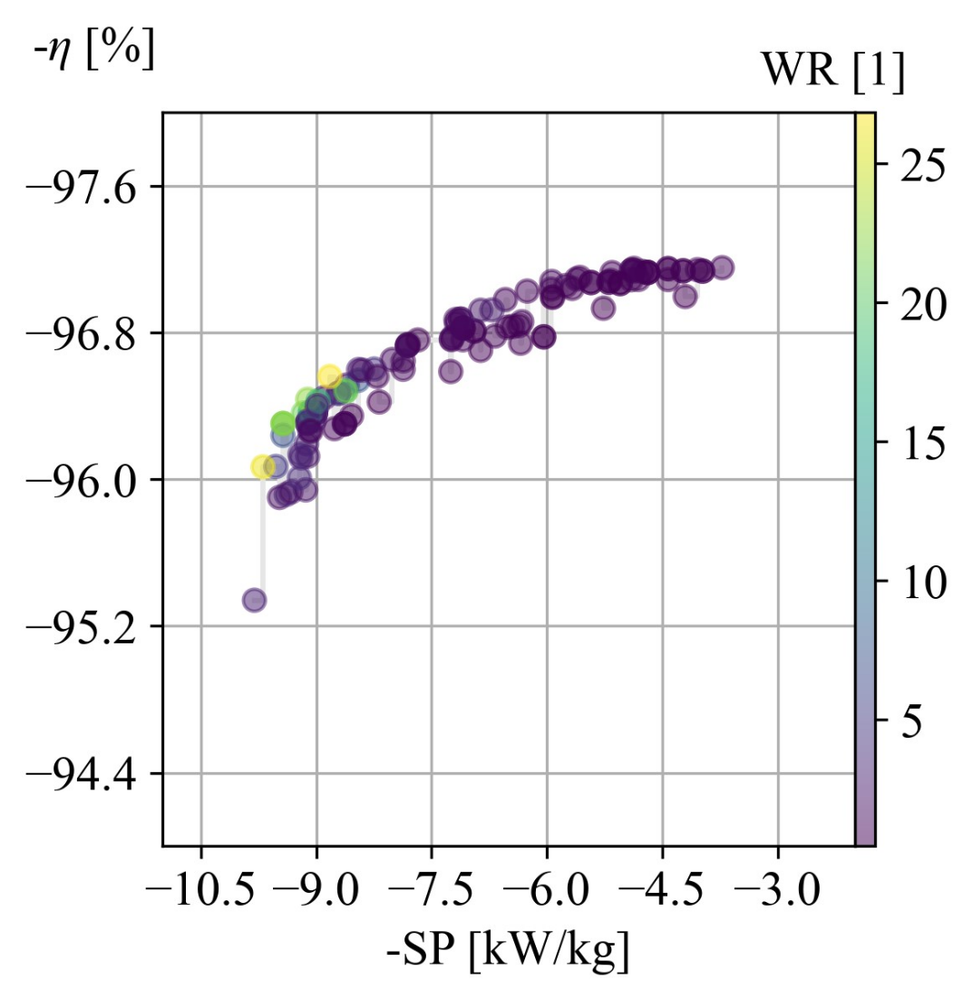

BSPM Optimization Tutorial
===========================================

* **Goal:** Leverage capabilites of ``mach_opt`` and ``mach_eval`` to perform multi-objective, multi-physics optimization of
  bearingless surface permamanent magnet machines
* **Complexity** 4/5
* **Estimated Time** 45 - 60 min

This tutorial demonstrates how to perform a multi-objective, multi-physics optimization of BSPM machines using ``eMach``. By the end of this 
tutorial you will be able to:

* optmize BSPM designs for desired objectives
* post-proccess optimization archive data to understand design space, select and share candidate designs

Requirements 
---------------------

#. Python packages installed as discussed in :doc:`Pre-requisites <../../pre_reqs>`
#. Installation of JMAG v19 or above
#. Personal repo using ``eMach`` as submodule established (see :doc:`Rectangle Tutorial <../rectangle_tutorial/index>`)
#. :doc:`BSPM evaluation tutorial <../bspm_eval_tutorial/index>` completed

Background
-----------------------------------

The ``mach_opt`` module of ``eMach`` provides classes to interface with the ``Python`` optimization package ``Pygmo``. This module has been 
designed considering the optimization workflow provided below. In this tutorial, we will go over how users can develop their own classes to
follow this workflow and leverage ``mach_opt`` for optimization.

.. figure:: ./images/MachOptFlowChart.svg
   :alt: ``mach_opt`` Flowchart
   :align: center
   :width: 400 

Step 1: Create BSPM ``Designer``
----------------------------------------------------------------------

Nearly all population based optimization workflows function by creating a set of ``Free Variables``, and thereafter, evaluating the resulting
fitness corresponding to these variables. There are a number of steps involved in this process. Creating a ``Design`` from the set of
``Free Variables`` is the first step. The class that performs this function is called the ``Designer`` in ``eMach`` terminology. To create
a ``Designer``, we much first decide what the input ``Free Variables`` are, and what the desired output ``Design``. For this optimization, a set
of 11 ``Free Variables`` are considered to optimize both the rotor and stator geometry. These ``Free Variables`` are :math:`\delta_e`, 
:math:`r_{ro}`, :math:`\alpha_{st}`, :math:`d_{so}`, :math:`w_{st}`, :math:`d_{st}`, :math:`d_{sy}`, :math:`\alpha_m`, :math:`d_m`, 
:math:`d_{mp}`, and :math:`d_{ri}` dimensions. Readers can refer to the :doc:`BSPM machine <../../../machines/bspm/bspm_machine>` document to 
understand the physical dimensions corresponding to these ``Free Variables``. The output of the ``Designer`` is a BSPM ``Design`` which comprises
of a :doc:`BSPM Machine <../../../machines/bspm/bspm_machine>` and its corresponding :doc:`operating point <../../../machines/bspm/bspm_oper_pt>`.
The BSPM ``Designer`` has an ``Architect`` to create the ``BSPM_Machine`` from ``Free Variables``, and a ``Settings_Handler`` to creates the 
``BSPM_Machine_Oper_Pt`` object from ``Free Variables``. As the operating point remains the in this optimization, the ``Settings_Handler`` 
always returns the same ``BSPM_Machine_Oper_Pt`` object. 

To create the BSPM ``Designer``, copy the ``bspm_architect.py``, ``bspm_settings_handler.py``, and ``bspm_designer.py`` files from the
``examples/mach_opt_examples/bspm_opt`` folder to your root directory. Update the import statements found at the top of each module as shown 
below to ensure the code works with the files in the new location.

For ``bspm_architect.py``:

.. code-block:: python

    import numpy as np

    from eMach.mach_eval.machines.bspm import BSPM_Machine
    from eMach.mach_eval.machines.bspm.winding_layout import WindingLayout

For ``bspm_settings_handler.py``:

.. code-block:: python

    from eMach.mach_eval.machines.bspm.bspm_oper_pt import BSPM_Machine_Oper_Pt

For ``bspm_designer.py``:

.. code-block:: python

    from bspm_architect import BSPM_Architect1
    from eMach.mach_eval.machines.bspm.bspm_specification import BSPMMachineSpec
    from eMach.mach_eval.machines.materials.electric_steels import Arnon5
    from eMach.mach_eval.machines.materials.jmag_library_magnets import N40H
    from eMach.mach_eval.machines.materials.miscellaneous_materials import (
        CarbonFiber,
        Steel,
        Copper,
        Hub,
        Air,
    )
    from bspm_settings_handler import BSPM_Settings_Handler
    from eMach.mach_eval import MachineDesigner

Step 2: Create BSPM Design ``Evaluator``
--------------------------------------------------------------------

Simply use the multi-physics BSPM design ``Evaluator`` developed in the :doc:`BSPM Evaluation Tutorial <../bspm_eval_tutorial/index>` in this 
step. Structural, electromagnetic, and thermal performance of BSPM designs will be analyzed using this ``Evaluator``. The coil temperature
limit set in Step 2.4 of :doc:`BSPM Evaluation Tutorial <../bspm_eval_tutorial/index>` can be reduced from 300 degC to 150 degC to optimize 
for a more realistic BSPM machine.

Step 3: Create BSPM Optimization Design Space
--------------------------------------------------------------------

Finally, before running the optimization, the number of optimization objectives, the objectives themselves, and the bounds for the ``Free 
Variables`` must be decided upon. This information is held within the ``BSPMDesignSpace`` object. The optimization is run considering three 
objectives. This includes minimizing torque, force ripple, and maximizing efficiency, power density. The class is configured such that the 
bounds are passed in as an argument during instatiation to provide users with the freedom of setting the bounds within the actual optimization 
script. To create the ``BSPMDesignSpace`` class, copy the ``bspm_ds.py`` file from the ``examples/mach_opt_examples/bspm_opt`` folder. The 
file can be used as is.

Step 4: Update ``mach_opt`` ``DataHandler`` (if required)
--------------------------------------------------------------------

During optimization, a huge dataset of BSPM designs and information related to their performance is created. It is important to save this data
for post-processing and to resume optimization in case it terminates prematurely due to unforseen errors. The base ``DataHandler``
provided within ``mach_opt`` implements the basic functionalities for optimization data handling, including saving and loading optimization
data using ``pickle``, extracting Pareto optimal designs etc. However, it might be desirable to add other functionalities, especially for
selecting candidate designs for further investigation. Users can do this by inheriting the ``mach_opt`` ``DataHandler`` class and adding their
own methods. You can copy the ``my_data_handler.py``  file in ``examples/mach_opt_examples/bspm_opt`` to use the additional features of design
selection, seving etc. Update the import statements as shown below:

.. code-block:: python

    import eMach.mach_opt as mo

Step 5: Run Optimization
--------------------------------------------------------------------

Finally, the multi-objective, multi-physics optimization can be run by combining the modules created up to this step. The code snippet 
provided below shows how to run this optimization. This code should be saved to a new Python file named ``bspm_optimization.py``. The optimization
should run for as many generations as required to obtain the Pareto Front. If the optimization terminates before this is achieved due to
unexpected errors, simply run the script again and the optimziation will resume from the last saved generation (based on ``latest_pop.csv``). 

.. code-block:: python

    from bspm_designer import designer
    from bspm_evaluator import evaluator
    from bspm_ds import BSPMDesignSpace
    from eMach.mach_opt import DesignProblem, DesignOptimizationMOEAD
    from my_data_handler import MyDataHandler

    # set bounds for pygmo optimization problem
    bp2 = (
        0.00275,
        0.01141,
        44.51,
        5.43e-3,
        9.09e-3,
        16.94e-3,
        13.54e-3,
        180.0,
        3.41e-3,
        1e-3,
        3e-3,
    )

    bounds = [
        [0.5 * bp2[0], 2 * bp2[0]],  # delta_e
        [0.5 * bp2[1], 2 * bp2[1]],  # r_ro    this will change the tip speed
        [0.2 * bp2[2], 1.1 * bp2[2]],  # alpha_st
        [0.2 * bp2[3], 2 * bp2[3]],  # d_so
        [0.2 * bp2[4], 3 * bp2[4]],  # w_st
        [0.5 * bp2[5], 2 * bp2[5]],  # d_st
        [0.5 * bp2[6], 2 * bp2[6]],  # d_sy
        [0.5 * bp2[7], 1 * bp2[7]],  # alpha_m
        [0.2 * bp2[8], 2 * bp2[8]],  # d_m
        [0 * bp2[9], 1 * bp2[9]],  # d_mp
        [0.3 * bp2[10], 2 * bp2[10]],  # d_ri
    ]

    # create optimization Design Space object
    opt_settings = BSPMDesignSpace(3, bounds)

    # create optimization Data Handler
    path = os.path.dirname(__file__)
    arch_file = path + r"\opti_arch.pkl"  # specify file where archive data will reside
    des_file = path + r"\opti_designer.pkl"
    pop_file = path + r"\latest_pop.csv"  # csv file holding free variables of latest population
    dh = MyDataHandler(arch_file, des_file)  # initialize data handler with required file paths

    # create pygmo Problem
    design_prob = DesignProblem(designer, evaluator, opt_settings, dh)
    # defin pygmo MOEAD optimization
    design_opt = DesignOptimizationMOEAD(design_prob)

    # define population size and number of generations
    pop_size = 78
    gen_size = 20

    # load latest population
    population = design_opt.load_pop(filepath=pop_file, pop_size=78)
    # create random initial population if no prior data exists
    if population is None:
        print("NO EXISTING POPULATION TO LOAD")
        population = design_opt.initial_pop(pop_size)

    # RUN OPTIMIZATION
    pop = design_opt.run_optimization(population, gen_size, pop_file)

Step 6: Optimization Post-Processing
--------------------------------------------------------------------
	
To truly leverage optimization, users must be able to effectively analyze the resulting data. This includes extracting the Pareto front,
evaluating trends in the ``Free Variables``, selecting candidate designs etc. Copy the ``my_plotting_functions.py`` file from the 
``examples/mach_opt_examples/bspm_opt`` folder to get the custom functions created for plotting the Pareto front and ``Free Variables`` of
this optimization. Create a file named ``plot_script.py``. Copy paste the code provided below to plot the Pareto front. As this optimization
has three objetives, the marker color is used to indicate the value of the third objective, weighted ripple.

.. code-block:: python

    import os

    from data_handler import MyDataHandler
    from my_plotting_functions import DataAnalyzer

    path = os.path.dirname(__file__)
    arch_file = path + r'/opti_arch.pkl'  # specify path where saved data will reside
    des_file = path + r'/opti_designer.pkl'
    dh = MyDataHandler(arch_file, des_file)  # initialize data handler with required file paths

    fitness, free_vars = dh.get_pareto_fitness_freevars()
    fts = np.asarray(fitness)

    da = DataAnalyzer(path)
    # # da.plot_fitness_tradeoff(fitness, rated_power, label=['SP [kW/kg]', '$\eta$ [%]', 'WR [1]', 'Power [kW]'],
    # #                           axes=[0,3], filename='pd_vs_power')
    da.plot_pareto_front(points=fitness, label=['-SP [kW/kg]', '-$\eta$ [%]', 'WR [1]'])

An example Pareto plot is shown below:

To plot trends in ``Free Variables`` from the beginning to the end of the optimization, copy paste the code provided below to ``plot_script.py``. 
The blue markers provide the value of the ``Free Variable`` corresponding to a design and the red lines indicate the bounds corresponding to 
each free variable. The bounds should be set such that they are not run into during optiimization if possible. 

.. code-block:: python

    fitness, free_vars = dh.get_archive_data()
    var_label = [
                '$\delta_e$ [m]', 
                "$r_ro$ [m]",
                r'$\alpha_{st}$ [deg]', 
                '$d_{so}$ [m]',
                '$w_{st}$ [m]',
                '$d_{st}$ [m]',
                '$d_{sy}$ [m]',
                r'$\alpha_m$ [deg]',
                '$d_m$ [m]',
                '$d_{mp}$ [m]',
                '$d_{ri}$ [m]',
                ]

    bp2 = (0.00275, 0.01141, 44.51, 5.43e-3, 9.09e-3, 16.94e-3, 13.54e-3, 180.0, 3.41e-3, 1e-3, 3e-3,)
    # # bounds for pygmo optimization problem
    bounds = [
        [0.5 * bp2[0], 2 * bp2[0]],  # delta_e
        [0.5 * bp2[1], 2 * bp2[1]],  # r_ro    this will change the tip speed
        [0.2 * bp2[2], 1.1 * bp2[2]],  # alpha_st
        [0.2 * bp2[3], 2 * bp2[3]],  # d_so
        [0.2 * bp2[4], 3 * bp2[4]],  # w_st
        [0.5 * bp2[5], 2 * bp2[5]],  # d_st
        [0.5 * bp2[6], 2 * bp2[6]],  # d_sy
        [0.99 * bp2[7], 1 * bp2[7]],  # alpha_m
        [0.2 * bp2[8], 2 * bp2[8]],  # d_m
        [0 * bp2[9], 1 * bp2[9]],  # d_mp
        [0.3 * bp2[10], 2 * bp2[10]],  # d_ri
    ]
    da.plot_x_with_bounds(free_vars, var_label, bounds)

An example plot of ``Free Variables`` trends is shown below:

.. figure:: ./images/FreeVariables.svg
   :alt: BSPM Cross-Section 
   :align: center
   :width: 500 

Finally to select a candidate design, add ``dh.select_designs()`` line to ``plot_script.py``. You will most likely need to modify the
design selection criteria in ``my_data_handler.py`` to get designs having the performance you want. After determining the design you wish to
analyze in further detail, use the following code to save it to a ``Pickle`` file for future reference. Code to extract relevant information
from the design ``Pickle`` file is also provided.

.. code-block:: python

    dh.select_designs()

    proj_120_ = dh.get_design( 'proj_120_')
    print("proj_120_ d_st", proj_120_.machine.d_st)

Conclusion
----------------

Congratulations! You have successfully used ``eMach`` to create a digital BSPM design and a multi-physics BSPM evaluator as well! You can now
attempt evaluating other BSPM designs using this evaluator and see what results you end up with.

