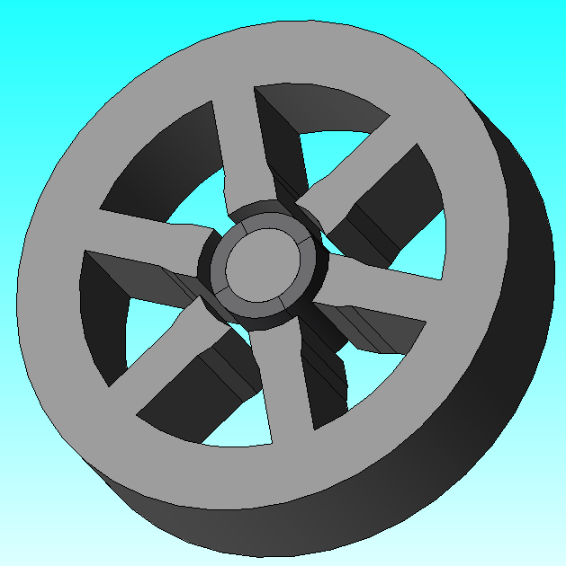

Making an Electric Machine using ``eMach``
===========================================

* **Goal:** Code and execute script to make an SPM machine using ``mach_cad`` module within ``eMach``
* **Complexity** 2/5
* **Estimated Time** 15 min

This tutorial demonstrates how to draw / build an SPM machine using the `tools` supported by ``eMach``. By the end of this 
tutorial you will be able to:

* use ``mach_cad`` classes to define 3D components
* draw 3D components in any ``eMach`` supported tool of your choice

Requirements 
---------------------

#. All required Python packages are installed on system (see :doc:`Pre-requisites <../../pre_reqs>`)
#. Installation of any one of the tools supported by ``eMach`` (eg: JMAG, MAGNET)
#. Personal repo using ``eMach`` as submodule established (see :doc:`Rectangle Tutorial <../rectangle_tutorial/index>`)

Step 1: Create script file with required module imports
--------------------------------------------------------------------

In the root folder of your repository, create a Python file named ``draw_spm.py``. All the code used in this example will be 
written in this file. At the top of ``draw_spm.py`` add the following import statements:

.. code-block:: python

    from eMach.mach_cad.tools import jmag as jd
    from eMach.mach_cad import model_obj as mo

These imports give the user access to capabilites offered by ``mach_cad``, in particular the JMAG-Python interface tool and the 
``model_obj`` classes which contain the smarts to draw different types of geometries commonly found in electric machines using 
certain parameter inputs.

Step 2: Create required ``mach_cad`` cross-sections
--------------------------------------------------------------------

In this step the user will create the different cross-sections required to define an `inner rotor surface permanent magnet`.
This includes cross-sections defining the stator iron, permanent magnets, and rotor back iron. Cross-sections supported by ``eMach``
vary greatly with regards to their degree of complexity from basic rectangles, to more involved geometries such as the stator of a
linear motor. The stator of the machine in this particular tutorial can be defined using the ``CrossSectInnerRotorStator`` class.
The below example code creates an inner rotor stator cross-section object which can be used subsequently for creating the component
in 3D. 

.. code-block:: python
	
    # define stator cross-section
    stator1 = mo.CrossSectInnerRotorStator(
        name="stator",
        dim_alpha_st=mo.DimDegree(44.5),
        dim_alpha_so=mo.DimDegree((44.5 / 2)),
        dim_r_si=mo.DimMillimeter(14.16),
        dim_d_sy=mo.DimMillimeter(13.54),
        dim_d_st=mo.DimMillimeter(16.94),
        dim_d_sp=mo.DimMillimeter(8.14),
        dim_d_so=mo.DimMillimeter(5.43),
        dim_w_st=mo.DimMillimeter(9.1),
        dim_r_st=mo.DimMillimeter(0),
        dim_r_sf=mo.DimMillimeter(0),
        dim_r_sb=mo.DimMillimeter(0),
        Q=6,
        location=mo.Location2D(anchor_xy=[mo.DimMillimeter(0), mo.DimMillimeter(0)]),
        theta=mo.DimDegree(0),
    )

Each of the arguments provided in the above class definition corresponds directly to a geomtric parameter of the inner rotor stator.
To know what these arguments correspond to users can navigate to the folder in which the implementation of each cross-section resides.
Here a `README.md` file and a `.svg` file describing each parameter is provided. This makes it convinient to view the geometry within github. 
The link to the inner rotor stator folder is provided `here <https://github.com/Severson-Group/eMach/tree/develop/mach_cad/model_obj/cross_sects/inner_rotor_stator>`_.
Please navigate to this link to get a better understanding of what each argument provided for the `CrossSectInnerRotorStator`
actually mean. All cross-sections also include the additional arguments of ``location`` and ``theta``. This is used to define the
displacement of the cross-section from the global origin (x=0, y=0, theta=0). 

Another key feature of ``eMach`` worth touching upon at this juncture is its capability to handle different ``dimensions``. In 
order to ensure that the dimensions expected by the user are respected across different platforms, ``eMach`` defines its own 
classes for linear and angular dimensions. In this particular 
example, we have used ``DimMillimeter`` to describe linear dimensions in mm and ``DimDegree`` to describe angular dimensions in 
degrees.

Similar to creating the ``CrossSectInnerRotorStator`` object, users are recommended to try creating other cross-sections objects
required for creating the SPM machine. This includes using the ``CrossSectArc`` for the magnets, and the ``CrossSectInnerNotchedRotor`` 
for the rotor. The dimensions can be specified according to the users whim, so long as the outer radius of the arc magnets are 
smaller than the inner radius of the stator bore, and the outer radius of the inner notched rotor is equal to the inner radius of 
the arc magnets. Users can create any multiple of 2 arc magnets in their SPM machine.

.. note:: If you get stuck at any point of the tutorial, the example_spm.py script provides a working example of drawing a 4 pole
  , 6 slot surface permanent magnet machine in JMAG using ``eMach`` which can be used as a reference

Step 3: Create ``Components`` from ``CrossSects``
--------------------------------------------------------------------
	
In the previous step, all information associated with the 2D geometry of each machine component was defined. To convert these 
cross-sections to components, we need to define 1) the material defining the component 2) a method by which the 2D cross-section
should be converted to a 3D component. For materials, ``eMach`` uses just a wrapper class with a ``name`` field. In the present
implementation, this ``name`` directly corresponds to the name of materials existing by default in the FEA tool and the code simply
assigns this material to the cross-section within the tool. For converting the cross-section to a 3D component, ``eMach`` currently
support 2 methods: extrude and revolve. Extrude, as the name implies, sets a height to the cross-section and extrudes it in a 
direction normal to the cross-section plane. Revolve rotates a cross-section about an axis and a center through a certain angle to
get a 3D component. In most applications, users will primarily be using the extrude feature.

The below code snippet shows how to create a component from a cross-section within ``eMach``. In this particular example, the stator
has been assigned a standard electric steel material supported by JMAG, ``10JNEX900``, and has been extruded to a length of 25mm with
the ``make_solid=mo.MakeExtrude(location=mo.Location3D(), dim_depth=mo.DimMillimeter(25))`` argument. Following a similar procedure,
components can be made for the remaining cross-sections as well. Users are recommended to use ``10JNEX900`` for the rotor and 
``Arnold/Reversible/N40H`` materials for the rotor back iron and magnets respectively. All cross-sections should be extruded to
the same height (25 mm in this case).

.. code-block:: python
	
    stator_comp = mo.Component(
        name="Stator",
        cross_sections=[stator1],
        material=mo.MaterialGeneric(name="10JNEX900", color=r"#808080"),
        make_solid=mo.MakeExtrude(location=mo.Location3D(), dim_depth=mo.DimMillimeter(25)),
	)

Step 4: Make ``Components``
--------------------------------------------------------------------

After step 3, all the information required to make components in any ``eMach`` tool is available. The final step of actually making
these components is achieved using the below classes / function calls. Again the code below shows the implementation for the
stator component alone.

.. code-block:: python
	
    # create an instance of the JMAG class
    tool_jmag = jd.JmagDesigner()
    
    file = r"full_SPM_trial.jproj"
    tool_jmag.open(comp_filepath=file, study_type="Transient")

    # make stator component
    stator1_handle = stator_comp.make(tool_jmag, tool_jmag)
	
    # add code below for remaining components

Upon running the above script, an instance of the JMAG application should be launched on your PC and the corresponding components
should be drawn in the sequence they were defined in. The end result is expected to look as shown in the figure below.

   
   
Conclusion
----------------

Congratulations! You have successfully used ``eMach`` to make a most of the components required to simulate a surface permament 
magnet machine! Users are recommended to further explore additional cross-sections currently supported by ``eMach`` or to create 
their own cross-sections which they feel are generic enough to find use in a wide range of electric machine applications.

