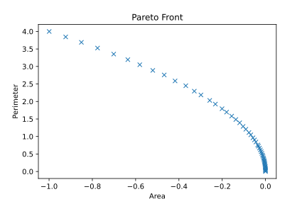

.. _rectangle_example:

Rectangle Tutorial 
==================
* **Goal:** Understand base ``mach_opt`` classes
* **Complexity** 2/5
* **Estimated Time** 20 min

This tutorial demonstrates how to run a simple optimization of a rectangle using ``eMach``. By the end of this tutorial you will:

* Be able to run simple optimizations using ``eMach``.
* Construct the primary classes used in the ``mach_opt`` module

In this tutorial a rectangle will be optimized to maximize its area while minimizing its perimeter. This is a common first multi-objective optimization, and is used here to demonstrate the base functionality of eMach.

.. figure:: ./images/RectangleExample.svg
   :alt: Trial1 
   :align: center
   :width: 800 

Tutorial Requirements 
---------------------

This is the first tutorial so the only requirement is:

#. All required Python packages are installed on system. (See :doc:`Pre-requisites <../../pre_reqs>`)

Step 1: Create new repository
------------------------------------------

First a personal repository for this tutorial will be created. This repository will hold all the user written code developed in these tutorials. Open a new empty folder and input the following code into git-bash to initialize the repository.

.. code-block:: 
	
	git init

Step 2: Clone eMach as a sub-module
------------------------------------------

In order to utilize the eMach codebase, it must first be installed as a sub-module in your repository. In the root folder of your repository open a git bash and input the following command line:

.. code-block:: 
	
	git submodule add https://github.com/Severson-Group/eMach.git

This should add the current develop branch of ``eMach`` as a folder in the base layer of your personal repository.

Step 3: Create main optimization file
------------------------------------------

In the root folder of your repository, create a python file named ``main.py``. All the code used in this example will be written in this file. This will be the file where the user inserts their custom code and runs the optimization. At the top of ``main.py`` add the following import statements:

.. code-block:: python

	from matplotlib import pyplot as plt
	import pygmo as pg
	from eMach import mach_opt as mo

These imports give the user access to plotting capabilities from ``matplotlib``, the open-source optimization library ``pygmo``, and the base protocols and classes in the ``mach_opt`` modules of ``eMach``.

Step 4: Create required mach_opt classes
------------------------------------------

In this step the user will fulfill the required ``Protocols`` from the ``mach_opt`` repository needed to define the evaluation. The three protocols discussed in this tutorial are the: 

Designer
	The ``Designer`` protocol converts an input tuple into a ``design`` object.
Evaluator
	The ``Evaluator`` evaluates the ``design`` object for a set of criteria defined in the ``evaluate`` function
DesignSpace
	The ``DesignSpace`` handles converting the results of the evaluation into the objective variables.
	
The final protocol of the ``mach_opt`` modules, the ``DataHandler``, is not discussed in this example.

The general flow of information in the ``des_opt`` module is shown in the following flow chart. The optimization algorithm will pass a set a free variables to the ``DesignProblem`` object, which in turn will be provided to the ``Designer``. The ``Designer`` will convert the free variables into a ``design`` object which is then passed to the ``Evaluator``. The ``Evaluator`` is responsible for evaluating the ``design`` object. The results of the evaluation, are then handed to the ``DesignSpace`` which converts the results of the evaluation into objective values in a form that the optimization algorithm can handle.

.. figure:: ./images/DesOptlFlowChart.svg
   :alt: Trial1 
   :align: center
   :width: 300 

Step 4.1: Create Designer and Design class
##########################################

The ``Designer`` protocol of the ``mach_opt`` module is designed as a contract which defines how the optimization will convert the free variables tuple from ``pygmo`` to a ``design`` object. The ``design`` object is a container which holds all the information about a design known at the start of the evaluation process.  Only one function, ``create_design(x)``, is required to be implemented to fulfill the ``Designer`` protocol.

In this example, the ``Designer`` protocol is implemented by the ``RectDesigner`` class. For this example, the required ``create_design(x)`` method of the ``Designer`` protocol extracts the length and width from the free variables and passes them into the ``Rectangle`` object (this optimization's ``Design`` object).

.. note:: In this example both the ``RectDesigner`` and ``Rectangle`` classes explicitly inherent the base protocols from ``mach_opt``.  Since the parent classes are ``Protocols``, child classes do not need to explicitly inherit the parent, just the required methods must be implemented. 

Copy the following code into your ``main.py`` file. These two classes fulfill the ``Designer`` and ``Design`` protocols specified in the ``mach_opt`` repository. This code will convert the free variable tuple ``x`` provided by ``pygmo`` into a ``Rectangle`` object to be evaluated.

.. code-block:: python

	class RectDesigner(mo.Designer):
		"""Class converts input tuple x into a Rectangle object"""
		
		def create_design(self,x:tuple)->"Rectangle":
			"""
			converts x tuple into a Rectangle object.

			Args:
				x (tuple): Input free variables.
				
			Returns:
				rect (Rectangle): Rectangle object
			"""
			
			L=x[0]
			W=x[1]
			rect=Rectangle(L,W)
			return rect
		
.. code-block:: python

	class Rectangle(mo.Design):
		"""Class defines a rectangle object of Length and width
		
		Attributes:
			L (float): Length of Rectangle.
			W (float): Width of Rectangle.
		"""
		
		def __init__(self,L:float,W:float):
			"""Creates Rectangle object.

			Args:
				L (float): Length of Rectangle
				W (float): Width of Rectangle

			"""
			self.L=L
			self.W=W
		
Step 4.2: Create Evaluator class
################################

The ``Evaluator`` protocol of ``mach_opt`` is used to define the the evaluation process for an optimization. There is only one required method for an ``Evaluator`` protocol: ``evaluate(design)``. In this example, the ``RectEval`` class fulfills the ``Evaluator`` protocol. The ``evaluate(design)`` method is used to calculate the area and perimeter of the ``Rectangle`` object created by the ``RectDesigner``. 

Copy the following code block into the ``main.py`` file. This code defines the ``Evaluator`` class which will be used to evaluate the rectangle for its area and perimeter.

.. code-block:: python

	class RectEval(mo.Evaluator):
		""""Class evaluates the rectangle object for area and perimeter"""
		
		def evaluate(self,rect):
			"""Evalute area and perimeter of rectangle

			Args:
				rect (Rectangle): Rectangle Object

			Returns:
				[A,Per] (List[float,float]): Area and Perimeter of rectangle

			"""
			A=rect.L*rect.W
			Per=2*rect.L+2*rect.W 
			return [A,Per]
			
.. note:: The results of an ``Evaluator`` are not required to be returned in a set form. However, for complicated optimization the use of dictionary objects can be helpful to ensure proper bookkeeping of the results.

Step 4.3: Create DesignSpace class
##################################

The final protocol implemented in this example, is the ``DesignSpace``. The ``DesignSpace`` protocol is used to convert the results of the evaluation process back to a form which ``pygmo`` can utilize. There are four required methods for the ``DesignSpace`` protocol which must be implemented.

get_objectives(valid_constraints, full_results)
	This method must extract the required objective values for the optimization from the results of the evaluation process.
check_constraints(full_results)
	This method is used to apply a death penalty constraint if needed for the optimization. This is not used in this example.
n_objs()
	This method must be implemented using Python's ``property`` decorator. it returns the number of objective values the optimization returns. This values is required by ``pygmo`` inorder to run the optimization.
bounds()
	This method must also be implemented using Python's ``property`` decorator. The bounds method must return a 2xN tuple which holds the lower and upper bounds for the free variables. ``pygmo`` will look at this method to determine the number and range of free variables to use.

The ``RectDesignSpace`` class is used in this example to implement the ``DesignSpace`` protocol.  Once again copy the following code section into the ``main.py`` file. The primary method on interest in this example is the ``get_objectives`` method. For this tutorial, the ``full_results`` object returned by the ``Evaluator`` class is a list of the area and perimeter of the rectangle. The goal of the optimization is to maximize the area and minimize the perimeter, however ``pygmo`` will always attempt to minimize the objective values. To circumvent this, the ``DesignSpace`` class returns a negative area.

.. code-block:: python

	class RectDesignSpace(mo.DesignSpace):
		"""Class defines objectives of rectangle optimization"""

		def __init__(self,bounds,n_obj):
			self._n_obj=n_obj
			self._bounds=bounds
			
		def get_objectives(self, valid_constraints, full_results) -> tuple:
			""" Calculates objectives from evaluation results
			

			Args:
				results (List(float,float)): Results from RectEval

			Returns:
				Tuple[float,float]: Maximize Area, Minimize Perimeter
			"""
			Area = full_results[0]
			Perimeter = full_results[1]
			return (-Area,Perimeter)
		
		def check_constraints(self, full_results) -> bool:
			return True
		
		@property
		def n_obj(self) -> int:
			return self._n_obj
		
		@property
		def bounds(self) -> tuple:
			return self._bounds
			
Step 4.4: Create dummy DataHandler class
########################################
for this example, we will not be implementing a ``DataHandler`` class to save the optimization results. However ``eMach`` still requires a class with the functions calls to be created. The following code block should be copied into ``main.py`` as a dummy ``DataHandler`` class.

.. code-block:: python

	class DataHandler:
		def save_to_archive(self, x, design, full_results, objs):
			"""dummy data handler"""
			pass
		def save_designer(self, designer):
			pass

Step 5: Initialize custom classes
------------------------------------------

Now that the custom classes implementing the prescribed protocols from ``mach_opt`` have been defined. The user must create instances of the classes to be used for the optimization. For this example, the ``RectDesigner`` and ``RectEval`` classes don't require any initialization variables to be passed in. The ``RectDesignSpace`` object requires the the bounds of the free variables, and the number of objectives to be passed in on initialization. As noted previously the ``bounds`` object is a 2xN tuple that gives the lower and upper bounds for the free variables. For this example we are setting the bounds for the length and width to be 0 to 1.

Copy the following code into the bottom of ``main.py``. This code will create instances of the defined ``Designer``, ``Evaluator``, and ``DesignSpace`` classes from earlier steps. 

.. code-block:: python

	###############################
	### Create mach_opt objects ###
	###############################
	des=RectDesigner()
	evaluator=RectEval()
	dh=DataHandler()
	## Define optimization bounds and number of objectives
	bounds=([0,0],[1,1])
	n_obj=2
	## Inject bounds and number of objectives into DesignSpace
	ds=RectDesignSpace(bounds,n_obj)

Step 6: Inject custom classes into DesignProblem
------------------------------------------------

In the ``mach_opt`` module, the ``DesignProblem`` is a concrete class which is used to directly interface with ``pygmo`` optimizations. The user does not need to modify any code in the ``DesignProblem`` class, they must just initialize an instance, by passing in their custom defined ``Designer``, ``Evaluator``, ``DesignSpace``, and ``DataHandler`` objects. To create the ``DesignProblem`` used in this example, copy the following code into the bottom of ``main.py``.

.. code-block:: python

	machDesProb=mo.DesignProblem(des,evaluator,ds,dh)

Step 7: Set up optimization code
------------------------------------------------

In ``mach_opt`` the ``DesignOptimizationMOEAD`` class is provided to run a MOEAD optimization problem. This class is simply a container for ``pygmo`` optimization code. Using the following code block, an optimization can be run using the user created ``DesignProblem`` object from the previous step. This optimization is setup to run for 10 generations with a population of 50 designs.

.. code-block:: python

	opt=mo.DesignOptimizationMOEAD(machDesProb)
	pop_size=50
	pop=opt.initial_pop(pop_size)
	gen_size=10    
	pop=opt.run_optimization(pop,gen_size)
	
.. note:: If the user wishes to use another algorithm in ``pygmo``, The ``DesignOptimizationMOEAD`` can be modified. The ``DesignProblem`` class is defined so that it is compatible with all multi-objective algorithms in used ``pygmo``. 

Step 8: Extracting and plotting results
------------------------------------------------

The following code block will extract results from the optimization and plot the Pareto front for this optimization. The ``pop.get_f()`` method returns a vector of the objective values for the optimization, while the ``pop.get_x()`` method returns the free variable tuples for the optimized population. 

.. code-block:: python

	fig1=plt.figure()   
	plot1=plt.axes()
	fig1.add_axes(plot1)
	fits, vectors = pop.get_f(), pop.get_x()
	ndf, dl, dc, ndr = pg.fast_non_dominated_sorting(fits) 
	plot1.plot(fits[ndf[0],0],fits[ndf[0],1],'x')
	plot1.set_xlabel('Area')
	plot1.set_ylabel('Perimeter')
	plot1.set_title('Pareto Front')
	
``pygmo`` provides a method to extract the Pareto in the method ``fast_non_dominated_sorting(fits)``, the returned ``ndf`` object is a list of the indexes for the Pareto fronts. If the code was correctly implemented, then the results of the optimization should look similar to the following plot.

	

Conclusion
----------

You have successfully completed your first optimization using ``eMach``. This code can be modified to perform other simple optimizations. The user should attempt to modify the code to perform the following list of optimizations:

* Optimize a circle for maximum area and minimum perimeter
* Optimize a cuboid for maximum volume and minimum surface area
* Optimize a sphere for maximum volume and minimum surface area 
