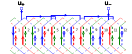

SynR Machine
##################

This class encapsulates the information required to fully represent a synchronous reluctance machine.

Machine Background
*************************

Synchronous reluctance machines or SynRs are machines capable of creating electromagnetic torque without permanent magnets or a wound field
located on the rotor. The primary aim of this machine class is to fully represent an actual SynR design. To do so, users are required to pass 
in information on key geometric dimensions such as rotor dimensions, machine parameters including number of pole pairs and machine ratings,
the materials constituting the machine, and the stator winding layout and connection to an external drive. 

Input from User
*********************************

The information required to instantiate the ``SynR_Machine`` class has been split into four dictionaries. Each dictionary has been expounded 
upon below. It should be noted that if the dictionaries do not include the required keys, the ``SynR_Machine`` class will raise an error.

SynR Dimensions
------------------------

The purpose of this dictionary is to fully define the geometrical dimensions of any SynR machine. This information is required by nearly all 
analyzers, be it structural, thermal, or electromagnetic, to evaluate SynR performance. The figure provided below represents a generic four pole, 
six slot SynR design. Relevant geometric dimensions have been labelled in this figure. 

.. list-table:: 

   * - .. figure:: ./images/MotorDesignParametersRotor.svg
         :alt: SynR Rotor Cross-Section 
         :width: 300
     - .. figure:: ./images/MotorDesignParametersStator.svg
         :alt: SynR Stator Cross-Section 
         :width: 300

Users are not required to pass in each and every dimension shown in the above figure as this can result in an over-constrained geometry. The 
required keys for this input are provided below:

.. csv-table:: `SynR Dimensions`
   :file: SynR_dimensions_dict.csv
   :widths: 70, 70, 30
   :header-rows: 1

The dimensions dictionary corresponding to the example design is:

.. code-block:: python

   SynR_dimensions = {
      'alpha_b': 135,
      'r_sh': 6,
      'r_ri': 6,
      'r_ro': 49,
      'r_f1': 0.1,
      'r_f2': 0.1,
      'r_f3': 0.1,
      'd_r1': 4,
      'd_r2': 8,
      'd_r3': 8,
      'w_b1': 4,
      'w_b2': 4,
      'w_b3': 4,
      'l_b1': 33.75,
      'l_b2': 24.4,
      'l_b3': 12.6,
      'l_b4': 13,
      'l_b5': 10,
      'l_b6': 7,
      'alpha_st': 25,
      'alpha_so': 12.5,
      'r_si': 50,
      'd_so': 5,
      'd_sp': 9,
      'd_st': 40,
      'd_sy': 36,
      'w_st': 12,
      'l_st': 100,
   }

SynR Parameters
------------------------

Apart from dimensions, knowledge of certain SynR parameters, such as number of slots, pole pairs, and rated conditions are required 
to define a SynR design. All such parameters are contained within this dictionary. This dictionary also includes the nameplate ratings of the 
machine such as the rater power, rated speed, etc. It is likely that users might not be aware of all parameters when they are evaluating a 
new SynR design (when running an optimization for example). In this case, dummy values can be passed in for the nameplate paramters and can 
be updated later after the evaluation process is complete using the ``SynR_Machine`` class's ``clone`` method. The required key-value pairs 
for this input are provided below:

.. csv-table:: `SynR Parameters`
   :file: SynR_params_dict.csv
   :widths: 70, 70, 30
   :header-rows: 1

The parameters dictionary corresponding to the optimized design of the paper cited above is:

.. code-block:: python

   SynR_parameters = {
      'p': 2,
      'Q': 12,
      "name": "Example_SynR_Machine",
      'rated_speed': 1800,
      'rated_power': 3600,
      'rated_current': 10,   
   }

SynR Materials
------------------------

This dictionary contains information on the materials making up the electric machine. This includes rotor and stator back iron material,
retaining sleeve material etc. Presently, each value of this dictionary is another dictionary defining the key properties of the material. The
key properties differs based on whether the material being defined is an electric steel, a permanent magnet, a retaining sleeve etc. Users
are recommended to go through the ``materials`` folder within ``mach_eval`` to better understand the expected key-value pairs for this 
dictionary.

.. csv-table:: `SynR Materials`
   :file: SynR_mat_dict.csv
   :widths: 70, 70
   :header-rows: 1

The material dictionary corresponding to the example design is:

.. code-block:: python

   from mach_eval.machines.materials.electric_steels import (Arnon5)
   from mach_eval.machines.materials.miscellaneous_materials import (
      Steel,
      Copper,
      Air,
   )

   SynR_materials = {
      "air_mat": Air,
      "rotor_iron_mat": Arnon5,
      "stator_iron_mat": Arnon5,
      "coil_mat": Copper,
      "shaft_mat": Steel,
   }

SynR Winding
------------------------

This dictionary contains information on the combined DPNV winding layout used in the SynR design. The ``winding_layout.py`` script file provided
within the ``SynR`` folder defines certain popular DPNV winding layouts. The required key-value pairs for this input are provided below:

.. csv-table:: `SynR Winding`
   :file: SynR_winding_dict.csv
   :widths: 70, 70
   :header-rows: 1

Further elaboration is required prior to providing the winding dictionary corresponding to the design discussed above. The winding layout 
of the example machine is shown below. This is a double layer, twelve slot winding with a coil span of 2. The blue lines correspond to phase U, 
red to phase V, and green to phase W coil sides. Solid and dotted lines are used to differentiate between the two winding layers. The numbers 
indicate the slot opening each coil side belongs to. Finally, arrows are used to indicate the direction in which current flows when a positive
voltage is applied across the + and - terminals of each coil.

The winding dictionary corresponding to the layout shown above is:

.. code-block:: python

   SynR_winding = {
      "no_of_layers": 2,
      "layer_phases": [ ['U', 'V', 'W', 'U', 'V', 'W', 'U', 'V', 'W', 'U', 'V', 'W'],
                           ['V', 'W', 'U', 'V', 'W', 'U', 'V', 'W', 'U', 'V', 'W', 'U'] ],
      "layer_polarity": [ ['+', '-', '+', '-', '+', '-', '+', '-', '+', '-', '+', '-'],
                           ['-', '+', '-', '+', '-', '+', '-', '+', '-', '+', '-', '+'] ],
      "pitch": 2,
      "Z_q": 20,
      "Kov": 1.8,
      "Kcu": 0.5,
      "phase_current_offset": 0,
   }

Creating a ``SynR_Machine`` object
*************************************

Finally, the below ``Python`` code block shows how to create a ``SynR_Machine`` object using the dictionaries shown above. A walk-through on
evalauting the electromagnetic performance of this machine is provided :doc:`here <../../EM_analyzers/SynR_jmag2d_analyzer>`.

.. code-block:: python

   from eMach.mach_eval.machines.SynR import SynR_Machine

   ecce_2020_machine = SynR_Machine(
            SynR_dimensions, SynR_parameters, SynR_materials, SynR_winding
        )
