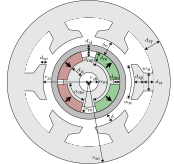
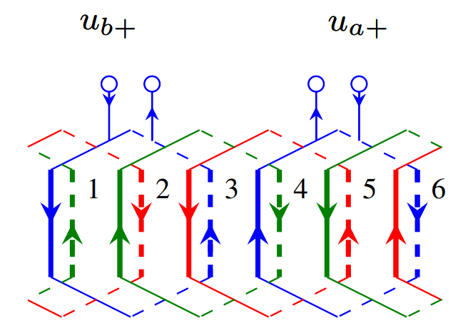

BSPM Machine
##################

This class encapsulates the information required to fully represent a bearingless surface permanent magnet machine.

Machine Background
*************************

Bearingless surface permanent magnet machines or BSPMs are bearingless machines of the :math:`p_\text{s}=p \pm 1` variant capable of creating
both force and torque. The primary aim of this machine class is to fully represent an actual BSPM design. To do so, users are required to pass 
in information on key geometric dimensions such as magnet thickness, machine parameters including number of torque and suspension pole pairs,
the materials constituting the machine, and the stator winding layout and connection to an external drive. Presently, the class is designed to 
support combined DPNV windings. 

Input from User
*********************************

The information required to instantiate the ``BSPM_Machine`` class has been split into four dictionaries. Each dictionary has been expounded 
upon below. Example dictionaries are provided as well to replicate the optimized BSPM design discussed in the `paper <https://doi.org/10.1109/ECCE44975.2020.9236181>`_ 
cited below to provide a concrete implementation of a ``BSPM_Machine`` object. It should be noted that if the dictionaries do not include the
required keys, the ``BSPM_Machine`` class will raise an error.

* A. Farhan, M. Johnson, K. Hanson and E. L. Severson, "Design of an Ultra-High Speed Bearingless Motor for Significant Rated Power," in 
  `IEEE Energy Conversion Congress and Exposition (ECCE)`, 2020, pp. 246-253, doi: 10.1109/ECCE44975.2020.9236181.

BSPM Dimensions
------------------------

The purpose of this dictionary is to fully define the geometrical dimensions of any BSPM. This information is required by nearly all analyzers,
be it structural, thermal, or electromagnetic, to evaluate BSPM performance. The figure provided below represents a generic two pole six slot 
BSPM design. Relevant geometric dimensions have been labelled in this figure. 

Users are not required to pass in each and every dimension shown in the above figure as this will result in an over-constrained geometry. The 
required keys for this input are provided below:

.. csv-table:: `BSPM Dimensions`
   :file: bspm_dimensions_dict.csv
   :widths: 70, 70, 30
   :header-rows: 1

The dimensions dictionary corresponding to the optimized design of the paper cited above is:

.. code-block:: python

   bspm_dimensions = {
      'alpha_st': 44.5, 
      'd_so': 0.00542, 
      'w_st': 0.00909, 
      'd_st': 0.0169, 
      'd_sy': 0.0135, 
      'alpha_m': 178.78, 
      'd_m': 0.00371, 
      'd_mp': 0.00307, 
      'd_ri': 0.00489, 
      'alpha_so': 22.25, 
      'd_sp': 0.00813, 
      'r_si': 0.01416, 
      'alpha_ms': 178.78, 
      'd_ms': 0, 
      'r_sh': 0.00281,
      'l_st': 0.0115, 
      'd_sl': 0.00067, 
      'delta_sl': 0.00011
      }

BSPM Parameters
------------------------

Apart from dimensions, knowledge of certain BSPM parameters, such as number of slots, number of torque and suspension pole pairs are required 
to define a BSPM design. All such parameters are contained within this dictionary. This dictionary also includes the nameplate ratings of the 
machine such as the rater power, rated speed etc. It is likely that users might not be aware of all parameters when they are evaluating a 
new BSPM design (when running an optimization for example). In this case, dummy values can be passed in for the nameplate paramters and can 
be updated later after the evaluation process is complete using the ``BSPM_Machine`` class's ``clone`` method. The required key-value pairs 
for this input are provided below:

.. csv-table:: `BSPM Parameters`
   :file: bspm_params_dict.csv
   :widths: 70, 70, 30
   :header-rows: 1

The parameters dictionary corresponding to the optimized design of the paper cited above is:

.. code-block:: python

   bspm_parameters = {
      'p': 1, 
      'ps': 2, 
      'n_m': 1, 
      'Q': 6, 
      'rated_speed': 16755.16, 
      'rated_power': 5500.0, 
      'rated_voltage': 240, 
      'rated_current': 10.0,
      'name': "ECCE_2020"
      }

BSPM Materials
------------------------

This dictionary contains information on the materials making up the electric machine. This includes rotor and stator back iron material,
retaining sleeve material etc. Presently, each value of this dictionary is another dictionary defining the key properties of the material. The
key properties differs based on whether the material being defined is an electric steel, a permanent magnet, a retaining sleeve etc. Users
are recommended to go through the ``materials`` folder within ``mach_eval`` to better understand the expected key-value pairs for this 
dictionary.

.. csv-table:: `BSPM Materials`
   :file: bspm_mat_dict.csv
   :widths: 70, 70
   :header-rows: 1

The material dictionary corresponding to the optimized design of the paper cited above is:

.. code-block:: python

   from eMach.mach_eval.machines.materials.electric_steels import Arnon5
   from eMach.mach_eval.machines.materials.jmag_library_magnets import N40H
   from eMach.mach_eval.machines.materials.miscellaneous_materials import (
      CarbonFiber,
      Steel,
      Copper,
      Hub,
      Air,
   )
   bspm_materials = {
      "air_mat": Air,
      "rotor_iron_mat": Arnon5,
      "stator_iron_mat": Arnon5
      "magnet_mat": N40H,
      "rotor_sleeve_mat": CarbonFiber,
      "coil_mat": Copper,
      "shaft_mat": Steel,
      "rotor_hub": Hub,
      }

BSPM Winding
------------------------

This dictionary contains information on the combined DPNV winding layout used in the BSPM design. The ``winding_layout.py`` script file provided
within the ``bspm`` folder defines certain popular DPNV winding layouts. The required key-value pairs for this input are provided below:

.. csv-table:: `BSPM Winding`
   :file: bspm_winding_dict.csv
   :widths: 70, 70
   :header-rows: 1

Further elaboration is required prior to providing the winding dictionary corresponding to the design discussed above. The winding layout 
of this machine is shown below. This is a double layer, six slot DPNV winding with a coil span of 2. The blue lines correspond to phase U, 
red to phase V, and green to phase W coil sides. Solid and dotted lines are used to differentiate between the two winding layers. The numbers 
indicate the slot opening each coil side belongs to. Finally, arrows are used to indicate the direction in which current flows when a +ve
voltage is applied across the +, - terminals of each coil.

The winding dictionary corresponding to the layout shown above is:

.. code-block:: python

   bspm_winding = {
      "no_of_layers": 2,
      # layer_phases is a list of lists, the number of lists = no_of_layers
      # first list corresponds to coil sides in first layer
      # second list corresponds to coil sides in second layer
      # the index indicates the slot opening corresponding to the coil side
      # string characters are used to represent the phases
      "layer_phases": [ ['U', 'W', 'V', 'U', 'W', 'V'], 
                        ['W', 'V', 'U', 'W', 'V', 'U'] ],
      # layer_polarity is a list of lists, the number of lists = no_of_layers
      # first list corresponds to coil side direction in first layer
      # second list corresponds to coil side direction in second layer
      # the index indicates the slot opening corresponding to the coil side
      # + indicates coil side goes into the page, - indicates coil side comes out of page
      "layer_polarity": [ ['+', '-', '+', '-', '+', '-'], 
                          ['-', '+', '-', '+', '-', '+'] ],
      # coil_groups are a unique property of DPNV windings
      # coil group is assigned corresponding to the 1st winding layer
      "coil_groups": ['b', 'a', 'b', 'a', 'b', 'a'],
      "pitch": 2,
      "Z_q": 49,
      "Kov": 1.8,
      "Kcu": 0.5,
      }

Creating a ``BSPM_Machine`` object
*************************************

Finally, the below ``Python`` code block shows how to create a ``BSPM_Machine`` object using the dictionaries shown above. A walk-through on
evalauting the electromagnetic performance of this machine is provided :doc:`here <../../EM_analyzers/bspm_jmag2d_analyzer>`.

.. code-block:: python

   from eMach.mach_eval.machines.bspm import BSPM_Machine

   ecce_2020_machine = BSPM_Machine(
            bspm_dimensions, bspm_parameters, bspm_materials, bspm_winding
        )
