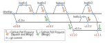

Maintainer Guidelines
==========================================

This guide is intended to describe the protocol adopted for the *eMach* code development. The eMach code base uses: `git <https://git-scm.com/>`_ for version control; `semantic versioning <https://semver.org/>`_ for release labeling.

.. tip:: Read about semantic versioning on the main `semver.org <https://semver.org/>`_ website. This greatly helps to explain the concepts below.

Branches in git
-------------------------------------------

All development intended to impact a future release is done on topic branches from the latest ``develop`` branch.
This applies to bug fixes, feature additions, and/or major changes.
The ``develop`` branch is not stable -- the latest commits to ``develop`` might yield unstable code which is still in testing.

Regular open-source development practice is followed -- pull requests PRs are used to review new code and then eventually are merged into ``develop``.

* Merges into ``develop`` should use ``Squash and Merge`` via GitHub's online interface.
* Merges into release branches should use the simple ``Merge`` commit via GitHub's online interface.

Each PR should be small enough to reasonably review -- if a PR has too many files changed or covers too large of scope, the developer will be asked to reduce the PR size by creating multiple smaller PRs.

Releases
-------------------------------------------

Per semantic versioning, there are three types of releases:

1. Major
2. Minor
3. Bug fix

To create a release, a snapshot of the code is taken and labeled as: ``vA.B.C`` where ``A`` denotes the major release number, ``B`` denotes the minor number, and ``C`` denotes the bug fix number. For example, a release might be called ``v1.0.0`` or ``v1.5.12``.

A so-called release branch refers to a labeled major and minor release, but unspecified bug fix.
The naming pattern is: ``vA.B.x`` where ``A`` and ``B`` are numbers and ``x`` denotes any bug fix number.
For example, the initial release branch is called ``v1.0.x``.

Release Planner
-------------------------------------------

eMach uses a `GitHub Project Board <https://github.com/orgs/Severson-Group/projects/26/views/1>`_ to track and schedule issues 
(bug fixes and features) for release. All new issues are automatically added to the project board with a status of ``Backlog``. 
The eMach development team triages these issues to either ``Future Feature`` or ``Future Bug Fix``. When a PR implements
code to address any issue, the developer (with help from reviewers) update the issue's status to the upcoming version of eMach 
that they believe the issue belongs in. This has implications for when (and into which branch) the PR should be merged. 

Guidelines for scheduling issues into releases are as follows:

1. Issues triaged as ``Future Bug Fix`` should correspond to Bug Fix releases
2. ``Future Feature`` issues are either Minor or Major releases, depending on if the code is backwards compatible.
3. Website changes that consist of correcting type-o's or existing code belong in a Bug Fix release while changes that affect the workflow of contributing to eMach belong in a Minor or Major release.
4. It is preferred to do timely releases (with only 1 or 2 issues) than to do infrequent, large releases.

.. _change-log:
Change Log 
------------------------------------------
A ``./CHANGELOG.md`` file is maintained to document incremental changes in each release of the project. 

Each entry in the change log should have a markdown heading of the version number (``VA.B.x``) followed by
a bullet list of changes in the style of commit messages based on the issues that are being released. The
overarching principle is that the list should be understandable and useful to the people who develop the 
code.

The following rules should be used to draft this message:

1. Keep each bullet brief
2. Always start each bullet with a verb. Use the same verbs as much as possible. ``Fix`` and ``Add`` should be the most common. ``Rename``, ``Remove``, and ``Extend`` are also acceptable.
3. Sort the bullets by the first word. Always list ``Fix`` first, then ``Add``.
4. Ideally, each of the bullets corresponds to an issue/PR. However, often this leads to too repetitive of a list. It is more important that the list be brief, so consolidate issues into a single bullet as makes sense.

See the `AMDC Firmware Project Repository <https://github.com/Severson-Group/AMDC-Firmware/blob/v1.1.x/CHANGELOG.md>`_ for examples of effective changelog entries.

Procedure 
-------------------------------------------

.. tip:: Refer to the diagram above for a graphical representation of how the git branching should work.

The procedure for creating a new release is mostly common for all three types (major, minor, bug fix):

1. Update code via topic branches which are based on ``develop`` and merge updates into ``develop``
2. Ensure development has stablized on the ``develop`` branch
3. Ensure thorough testing of the latest ``develop`` branch code
4. Review the issues scheduled for this release on the `eMach Release Planner <https://github.com/orgs/Severson-Group/projects/26/views/1>`_. Any issues that are not completed should be rescheduled to a future release
5. Create a label corresponding to the release (``vA.B.x``) and assign this to all issues being released 
6. Create and merge PR as the final commit to ``develop`` that updates the ``./CHANGELOG.md`` file with documentation about the new release. See :ref:`change-log` for instructions on drafting this. The PR should be named ``Add changelog notes for vA.B.x release``
7. Depending on which type of release, follow steps in either :ref:`bug-fix` or :ref:`major-minor`
8. Follow the steps in :ref:`tag-and-release`
9. For minor or major releases, add a release version to ReadTheDocs by navigating to ``Versions`` and clicking ``Activate`` on the newly created tag ``VA.B.0``.

.. _bug-fix:
Bug Fix
++++++++++++++++++++++++++++++++++++++++++++

For a new bug fix release, a release branch should already exist.
To publish the bug fix, simply merge the bug fix from ``develop`` into the appropriate release branches.
This should be done via a PR on GitHub and the PR should perform a regular merge commit, not a ``Squash + Merge``.

.. attention:: You might need to merge the bug fix into multiple release branches, depending on how widespread the bug is. Always merge in one direction, from ``develop`` to the release branches.

Occasionally, a bug might need to be fixed in a previous release branch, but does not exist in the latest ``develop`` branch.
In this case, do not change ``develop`` -- simply fix the bug where it needs to be fixed.
This is depicted in the above diagram as the ``hotfix1`` branch.

.. _major-minor:
Minor or Major
++++++++++++++++++++++++++++++++++++++++++++
For a new minor or major release, a new release branch needs to be created.

1. Create a new release branch from ``develop`` and call it ``vA.B.x``
2. Update GitHub's default repo branch to be the latest release branch which was just created
3. Update the documentation website to reflect the minor or major breaking changes

.. _tag-and-release:
Tag and Release
++++++++++++++++++++++++++++++++++++++++++++
After following the above steps, the release branch(es) will hold the latest stable code release.
Users which checkout the release branch will have access to the code.

Git tag(s) need to be created and GitHub release(s) need to be created.

1. Create git tag(s) pointing to the merge commit(s) on the release branch(es). If the new code was only merged to one release branch, only one tag will be created. However, if a bug fix was merged to multiple release branches, then the appropriate version number should be used to tag each merge commit.
2. For each new git tag, create a GitHub Release with the same name as the tag and include a description of the changes that is identical to the changelog contents.
