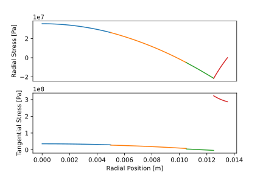

.. _structural_analyzer:

SPM Rotor Structural Analyzer
##############################

This page describes how the structural performance of a surface-mounted permanent magnet (SPM) rotor is evaluated using the eMach code base. The structural analyzer implemented is a combination of two analyzers. A base structural analyzer calculates the stress induced in the rotor, and a rotor sleeve analyzer calculates the optimum design of a carbon fiber sleeve. A detailed description of the math and physics for this problem can be found in the `this paper <https://ieeexplore.ieee.org/document/9595523>`_.

Model Background
****************

The SPM rotor can be modeled as a series of concentric cylinders as shown in the figure below. In this case the rotor is assumed to have four regions of varying material: a shaft, rotor back iron, magnets, and a sleeve. The sleeve is designed with an undersized fit in order to provide the compressive force on the rotor.

.. figure:: ./images/Structural/RotorConfig.svg
   :alt: Trial1 
   :align: center
   :width: 600 

.. figure:: ./images/Structural/SleeveOrientation.svg
   :alt: Trial1 
   :align: center
   :width: 600 

Base Structural Analyzer
************************
This section will described how to use the base structural analyzer for SPM machines ``SPM_RotorStructuralAnalyzer``. Two additional classes, the ``RotorComponent`` and the materials classes are defined first, these are used to create the ``SPM_RotorStructuralProblem`` which will be analyzed. Two material classes are included in this module, ``Material_Isotropic`` and ``Material_Transverse_Isotropic``. These objects are used to hold the relevant material properties, as well as derived material properties for the materials. The initialization of both these classes are provided below.

.. code-block:: python

    Material_Isotropic(Density, ElasticMod, PoissonRatio, alpha)
    Material_Transverse_Isotropic(Density,ElasticMod_Thread,ElasticMod_Plane,
                                  PoissonRatio_tp,PoissonRatio_p,alpha_r,alpha_t)
                                  
The ``RotorComponent`` class is initialized using the material classes as well as dimension of the inner and outer radius of the component as seen in following code:

.. code-block:: python

    RotorComponent(MaterialObject, InnerRadius, OuterRadius)

The ``SPM_RotorStructuralProblem`` takes in four ``RotorComponent`` objects, one for each of the components of the rotor (shaft: ``sh``, rotor core: ``rc``,magnets: ``pm``,sleeve: ``sl``), along with a temperature rise ``deltaT`` and a rotational speed ``omega`` in rad/s. 

.. code-block:: python

    SPM_RotorStructuralProblem(sh, rc, pm, sl, deltaT, omega))

    
The base structural analyzer uses the ``SPM_RotorStructuralProblem`` to calculate the stress distribution in the rotor components. The base analyzer ``SPM_RotorStructuralAnalyzer`` takes in a ``SPM_RotorStructuralProblem`` in its ``analyze`` method and returns a list of ``Sigma`` objects, one for each of the rotor components. The ``Sigma`` objects are used to calculate the radial and tangential stress at a radial position ``R`` in the component via their methods ``sigma.radial(R)`` and ``sigma.tangential(R)`` respectively. 

Sleeve Analyzer
***************
The rotor sleeve analyzer described here is used to design an optimal rotor sleeve which minimizes the required sleeve thickness in order to reduce cost, windage loss, and thermal issues. The sleeve analyzer expects a ``SleeveProblem`` in its analyze function signature. The ``SleeveProblemDef`` extracts the relevant information from the input state object to create the required problem object. Unlike the base structural analyzer, the sleeve analyzer is directly called by the ``MachineEvaluator`` object during evaluation.

Inputs for structural analyzer
******************************************
The current implementation of the structural analyzer requires a material dictionary (``mat_dict``), temperature coefficient, and dimensions of the shaft, rotor core, magnet, and sleeve. The following table shows the list of required inputs for the structural analyzer.

.. csv-table:: Inputs for structural analyzer -- ``mat_dict``
   :file: inputs_mat_dict.csv
   :widths: 70, 70, 30
   :header-rows: 1

.. csv-table:: Inputs for structural analyzer -- Dimensions
   :file: inputs_dimensions.csv
   :widths: 70, 70, 30
   :header-rows: 1

.. csv-table:: Inputs for structural analyzer -- ``stress_limits``
   :file: inputs_sleeve_stress.csv
   :widths: 70, 70, 30
   :header-rows: 1

How to use the structural analyzer
**********************************

The following code demonstrates how to utilize the sleeve analyzer to design a rotor sleeve for an example machine. 

.. code-block:: python

    from eMach.mach_eval.analyzers import spm_rotor_structrual_analyzer as sta
    
    mat_dict = {
        'core_material_density': 7650,  # kg/m3
        'core_youngs_modulus': 185E9,  # Pa
        'core_poission_ratio': .3,
        'alpha_rc' : 1.2E-5,

        'magnet_material_density'    : 7450, # kg/m3
        'magnet_youngs_modulus'      : 160E9, # Pa
        'magnet_poission_ratio'      :.24,
        'alpha_pm'                   :5E-6,

        'sleeve_material_density'    : 1800, # kg/m3
        'sleeve_youngs_th_direction' : 125E9,  #Pa
        'sleeve_youngs_p_direction'  : 8.8E9,  #Pa
        'sleeve_poission_ratio_p'    :.015,
        'sleeve_poission_ratio_tp'   :.28,
        'alpha_sl_t'                :-4.7E-7,
        'alpha_sl_r'                :0.3E-6,

        'sleeve_max_tan_stress': 1950E6,  # Pa
        'sleeve_max_rad_stress': -100E6,  # Pa

        'shaft_material_density': 7870,  # kg/m3
        'shaft_youngs_modulus': 206E9,  # Pa
        'shaft_poission_ratio': .3,  # []
        'alpha_sh' : 1.2E-5
    }

    stress_limits = {'rad_sleeve': -100E6,
                     'tan_sleeve': 1300E6,
                     'rad_magnets': 0,
                     'tan_magnets': 80E6}
    r_sh = 5E-3 # [m]
    d_m = 2E-3 # [m]
    r_ro = 12.5E-3 # [m]
    deltaT = 0 # [K]
    N = 100E3 # [RPM]

    #%% Sleeve Design Analzer Example
    problem = sta.SleeveProblem(r_sh, d_m, r_ro, deltaT, mat_dict, N)
    ana = sta.SleeveAnalyzer(stress_limits)
    sleeve_dim = ana.analyze(problem)
    print(sleeve_dim)

The stress distribution in the example rotor can be found via the base structural analyzer if following code is copied under the code above.

.. code-block:: python

    import numpy as np
    from matplotlib import pyplot as plt
    if sleeve_dim is False:
        print('No Valid Sleeve Found')
    else:
        d_sl=sleeve_dim[0]
        delta_sl=sleeve_dim[1]
        
        R1 = r_sh
        R2 = r_ro - d_m
        R3 = r_ro
        R4 = r_ro + d_sl
        # print('R1:',R1,'R2:',R2,'R3:',R3)
        ##############################
        #    Load Operating Point
        ##############################
        omega = N * 2 * np.pi / 60
        ##############################
        #   Load Material Properties
        ##############################
        rho_sh = mat_dict["shaft_material_density"]
        E_sh = mat_dict["shaft_youngs_modulus"]
        nu_sh = mat_dict["shaft_poission_ratio"]
        alpha_sh = mat_dict["alpha_sh"]  # 1.2E-5
        
        rho_rc = mat_dict["core_material_density"]
        E_rc = mat_dict["core_youngs_modulus"]
        nu_rc = mat_dict["core_poission_ratio"]
        alpha_rc = mat_dict["alpha_rc"]  # 1.2E-5
        
        rho_pm = mat_dict["magnet_material_density"]
        E_pm = mat_dict["magnet_youngs_modulus"]
        nu_pm = mat_dict["magnet_poission_ratio"]
        alpha_pm = mat_dict["alpha_pm"]  # 5E-6
        
        rho_sl = mat_dict["sleeve_material_density"]
        E_t_sl = mat_dict["sleeve_youngs_th_direction"]
        E_p_sl = mat_dict["sleeve_youngs_p_direction"]
        nu_p_sl = mat_dict["sleeve_poission_ratio_p"]
        nu_tp_sl = mat_dict["sleeve_poission_ratio_tp"]
        alpha_t = mat_dict["alpha_sl_t"]  # -4.7E-7
        alpha_r = mat_dict["alpha_sl_r"]  # .3E-6
        MaxRadialSleeveStress = mat_dict["sleeve_max_rad_stress"]
        MaxTanSleeveStress = mat_dict["sleeve_max_tan_stress"]
        ##############################
        #   Make Rotor Materials
        ##############################
        ShaftMaterial = sta.Material_Isotropic(rho_sh, E_sh, nu_sh, alpha_sh)
        RotorCoreMaterial = sta.Material_Isotropic(rho_rc, E_rc, nu_rc, alpha_rc)
        MagnetMaterial = sta.Material_Isotropic(rho_pm, E_pm, nu_pm, alpha_pm)
        SleeveMaterial = sta.Material_Transverse_Isotropic(
            rho_sl, E_t_sl, E_p_sl, nu_tp_sl, nu_p_sl, alpha_r, alpha_t
        )
        
        #######################################################################
        #                      Create Rotor Section Objects
        #######################################################################
        
        ##############################
        #    Create Shaft Object
        ##############################
        
        sh = sta.RotorComponent(ShaftMaterial, 0, R1)
        
        ##############################
        #  Create Rotor Core Object
        ##############################
        
        rc = sta.RotorComponent(RotorCoreMaterial, R1, R2)
        
        ##############################
        #    Create Magnets Object
        ##############################
        
        pm = sta.RotorComponent(MagnetMaterial, R2, R3)
        pm.set_MaxRadialStress(0)
        
        ##############################
        #   Create Sleeve Object
        ##############################
        
        sl = sta.RotorComponent(SleeveMaterial, R3, R4)
        sl.set_MaxRadialStress(MaxRadialSleeveStress)
        sl.set_MaxTanStress(MaxTanSleeveStress)
        
        sl.set_th(d_sl)
        sl.set_delta_sl(delta_sl)
        
        problem = sta.SPM_RotorStructuralProblem(sh, rc, pm, sl, deltaT, omega)
        analyzer=sta.SPM_RotorStructuralAnalyzer()
        
        sigmas=analyzer.analyze(problem)
        
        r_vect_sh=np.linspace(R1/10000,R1,100)
        r_vect_rc=np.linspace(R1,R2,100)
        r_vect_pm=np.linspace(R2,R3,100)
        r_vect_sl=np.linspace(R3,R4,100)
        
        
        fig,ax=plt.subplots(2,1)
        ax[0].plot(r_vect_sh,sigmas[0].radial(r_vect_sh))
        ax[0].plot(r_vect_rc,sigmas[1].radial(r_vect_rc))
        ax[0].plot(r_vect_pm,sigmas[2].radial(r_vect_pm))
        ax[0].plot(r_vect_sl,sigmas[3].radial(r_vect_sl))
        ax[0].set_xticks([])
        ax[0].set_ylabel('Radial Stress [Pa]')
        ax[1].plot(r_vect_sh,sigmas[0].tangential(r_vect_sh))
        ax[1].plot(r_vect_rc,sigmas[1].tangential(r_vect_rc))
        ax[1].plot(r_vect_pm,sigmas[2].tangential(r_vect_pm))
        ax[1].plot(r_vect_sl,sigmas[3].tangential(r_vect_sl))
        ax[1].set_ylabel('Tangential Stress [Pa]')
        ax[1].set_xlabel('Radial Position [m]')
        
        
Running the code above should produce the follow plot of radial and tangential stress in the example rotor.

