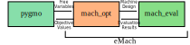

User Guide
=============================

``eMach`` is an open source codebase designed to facilitate the modeling, evaluation, and optimization of electrical machines. Since machine design is an extremely broad and varied field, ``eMach`` is constructed in a modular and flexible fashion to accommodate many machine topologies, evaluation processes, and optimization criteria. While certain base machine optimizations are provided in this repository, the code is intended for easy extension to produce custom optimizations.

The ``eMach`` codebase is designed to be used by ``pygmo``, an open source Python optimization library. Documentation for the ``pygmo`` library can be found `here <https://esa.github.io/pygmo2/>`_.

The ``eMach`` repository contains three sub-modules which interface between ``pygmo`` and each other. 

- The ``mach_opt`` module, short for `Machine Optimization`, is defined to interface with the specified ``fitness`` function call from ``pygmo`` by converting free variables to objective values in a structured format. This module is designed to extend the base functionality of ``pygmo`` to handle design optimizations using abstract classes. 
- The ``mach_eval`` module is used to evaluate a machine design either produced by ``mach_opt`` or as stand-alone machines that a user has created. ``mach_eval`` is an extension of two of the primary abstract classes in the ``mach_opt`` module which provide additional structure and framework to handle more complicated design evaluations. 
- The ``mach_cad`` module is used for drawing machine components in CAD tools. It provides an abstraction layer between the machine geometry specification and the CAD tool so that multiple tools can equivalently render the same design. This module is intended to provide a link between ``mach_eval`` and CAD tools. However, this functionality is not yet implemented.

The layered structure of ``eMach`` allows for the higher level modules to be used independently of the lower level packages. 

   The rest of this document will cover both the ``mach_opt`` and ``mach_eval`` modules, explaining their purpose and applications. 

.. toctree::
    :maxdepth: 4
    :numbered:

    codebase
    mach_eval_overview
    mach_opt_overview