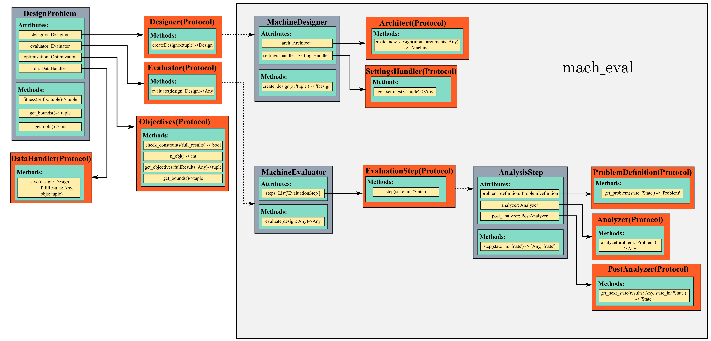
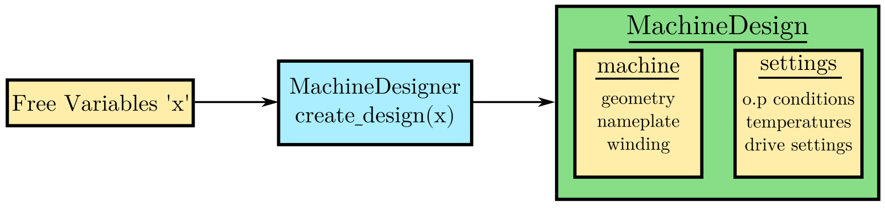
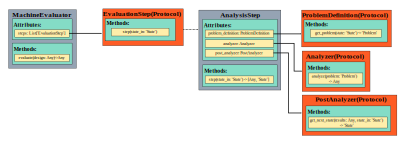
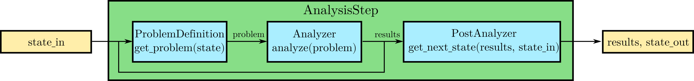

``mach_eval`` Module Overview
##########################################

In this section, both the ``MachineDesigner`` and ``MachineEvaluator`` classes of the ``mach_eval`` module will be introduced and 
explained. These classes act an extension of the ``mach_opt`` module's ``Designer`` and ``Evaluator`` protocols respectively. The 
purpose of this extension, is to provide a stronger framework for the flow of information between multiple evaluation steps (i.e. 
an interdependent multiphysics machine design). These classes are constructed specifically for the design and evaluation of 
electric machine, however they can be utilized in the optimization of any complex design problem. An example optimization 
demonstrating the use of the ``mach_eval`` module is provided :doc:`in this document</getting_started/tutorials/analytical_machine_des_tutorial/index>`.

MachineDesigner
****************

The ``MachineDesigner`` class is a concrete implementation of the ``Designer`` protocol from the ``mach_opt`` module. This class is responsible for converting free variables (likely from ``mach_opt``) into a ``MachineDesign`` object. The ``MachineDesign`` object has two attributes: 

- a ``machine`` object that holds all the relevant information about the machine, including geometric dimensions, material properties, nameplate values, and winding specifications. 
- a ``settings`` object that describes the operating conditions (temperatures, currents/drive settings, operating speed/torques) as well as any other required information to evaluate the design.

.. figure:: ./images/MachineDesignerProtocols.svg
   :alt: Trial1 
   :align: center
   :width: 800 
   
.. code-block:: python

	class MachineDesigner(Designer):
		"""Class representing a machine designer.

		Attributes:
			arch: Architect
			
			settings_handler: SettingsHandler
		"""
		def __init__(self, arch: 'Architect', settings_handler: 'SettingsHandler'):
			self.arch = arch
			self.settings_handler = settings_handler

		def create_design(self, x: 'tuple') -> 'Design':
			"""Creates a machine design from free variables.

			Args:
				x: Tuple of design free variables.
			Returns:
				A complete machine design including machine physical description and operating conditions.
			"""
			machine = self.arch.create_new_design(x)
			settings = self.settings_handler.get_settings(x)
			design = MachineDesign(machine, settings)
			return design

   
The ``MachineDesigner`` requires two objects to be passed in on initialization: an ``Architect`` and a ``SettingsHandler``. These inputs are defined as protocols and are responsible for the creation of the ``machine`` and ``settings`` objects respectively. These two objects are packaged together into a ``MachineDesign`` object which holds all the information about the design to be evaluated.

.. _arch-label:

Architect
+++++++++

The ``Architect`` protocol defines a function call for the creation of a ``machine`` object. This object is designed to be a container for information regarding "what is on the bench" i.e. machine geometry, material properties, winding configuration, and nameplate values. The machine represents a physical machine which is built, but does not contain information about that conditions it is operated at. 

.. code-block:: python

	class Architect(Protocol):
		"""Base class for all machine design creating architect classes.

		Child classes of Architect establish the interface between a machine object and the design framework. All the math
		for calculating an initial machine design is done within child classes of this class, and a design dictionary is
		passed into the Machine object class on creation.
		"""

		@abstractmethod
		def create_new_design(self, input_arguments: Any) -> "Machine":
			"""Creates a new Machine object and returns it
			
			Args:
				input_arguments: Any
			
			Returns:
				machine: Machine
			"""
			pass

.. _settings-handler:

SettingsHandler
+++++++++++++++

Similar to the ``Architect``, the ``SettingsHandler`` is responsible for creating a settings object which holds all other relevant information about the design and its operating point. 

.. code-block:: python

	class SettingsHandler(Protocol):
		
		@abstractmethod
		def get_settings(self, x: 'tuple'):
			pass

MachineEvaluator
****************

The ``MachineEvaluator`` class implements the ``Evaluator`` protocol from the ``mach_opt`` module. This class extracts evaluation results from the ``MachineDesign`` object created by the ``MachineDesigner``. The evaluation process is split into distinct steps which are described by an ``EvaluationStep`` protocol. These step objects take in an input ``state``, which holds the ``MachineDesign`` and any results from the previous evaluations, preform some evaluation on the design, and then package the results to a new ``state`` object. 

.. code-block:: python

	class MachineEvaluator(Evaluator):
		"""Wrapper class for all steps involved in analyzing a MachineDesign

		Attributes:
			steps: Sequential list of steps involved in evaluating a MachineDesign
		"""
		def __init__(self, steps: List['EvaluationStep']):
			self.steps = steps
		
		def evaluate(self, design: Any):
			"""Evaluates a MachineDesign

			Evaluates a MachineDesign with the list of evaluation steps that the class object was initialized with

			Args:
				design: MachineDesign object to be evaluated
			Returns:
				full_results: List of results obtained from each evaluation step
			"""
			state_condition = Conditions()
			state_in = State(design, state_condition)
			full_results = []
			for evalStep in self.steps:
				[results, state_out] = evalStep.step(state_in)
				full_results.append(deepcopy([state_in, results, state_out]))
				state_in = state_out
			return full_results

As seen in the code block above, during the ``evaluate`` method, a ``design`` object is passed into the method, and then packaged into a ``state`` object. The ``state`` object is a container for the  design object, as well as any results and conditions for the current evaluation. When the ``MachineEvaluator`` is initialized, an ordered list of ``EvaluationStep`` is passed in. During the ``evaluate`` method, this list is stepped through by passing the current ``state`` object into the ``step`` method of the current step. The results of the evaluation step are saved to the ``full_results`` list as an entry of the following form ``[state_in, results, state_out]``. By saving the results in this form before the state object is updated for the next step, a record of how the state changed as it is passed between steps is maintained. 

.. _eval-step:

EvaluationStep
++++++++++++++

The ``EvaluationStep`` protocol defines how state information should passed and returned with the ``step`` method. This method is where the machine evaluation takes place. 

.. code-block:: python

	@runtime_checkable
	class EvaluationStep(Protocol):
		"""Protocol for an evaluation step"""
		@abstractmethod
		def step(self, state_in: 'State') -> [Any, 'State']:
			pass

.. _analysis-step:

AnalysisStep
++++++++++++

``mach_eval`` provides a recommended concrete implementation of the ``EvaluationStep`` protocol in the form of the ``AnalysisStep`` class. This class is designed to handle the conversion of a user defined input ``state`` to the form required for a specific ``Analyzer``. The ``AnalysisStep`` class takes in three protocols on initialization:

ProblemDefinition
	Converts the input ``state`` into a ``problem`` class which can be utilized by the ``Analyzer``
Analyzer
	Performs an analysis on a problem. These are designed to handle specific analysis of complex machine design problems.
PostAnalyzer
	Packages the results of the analysis and the initial state back into the return state
	

   
The purpose of the ``AnalysisStep`` is to allow for generalized ``Analyzers`` to be utilized by multiple machine evaluations, where the end user only needs to specify the ``ProblemDefinition`` and ``PostAnalyzer`` classes. These later two classes serve as interfaces that convert a user-specific input state object into a general  ``problem`` that the ``Analyzer`` can handle. The results from the analysis of the problem are then returned to the post analyzer where they are packaged back into the output state object for the next evaluation step. 

.. code-block:: python

	class AnalysisStep(EvaluationStep):
		"""Class representing a step which involves detailed analysis.

		Attributes:
			problem_definition: class or object defining the problem to be analyzed. This attribute acts as the interface between the machine design and the analyzer.
			
			analyzer: class or object which evaluates any aspect of a machine design.
			
			post_analyzer: class or object which processes the results obtained from the analyzer and packages in a form suitable for subsequent steps.
		"""
		def __init__(self, problem_definition, analyzer, post_analyzer):
			self.problem_definition = problem_definition
			self.analyzer = analyzer
			self.post_analyzer = post_analyzer

		def step(self, state_in: 'State') -> [Any, 'State']:
			"""Method to evaluate design using a analyzer

			Args:
				state_in: input state which is to be evaluated.
			Returns:
				results: Results obtained from the analyzer.
				
				state_out: Output state to be used by the next step involved in the machine design evaluation.
			"""
			problem = self.problem_definition.get_problem(state_in)
			results = self.analyzer.analyze(problem)
			state_out = self.post_analyzer.get_next_state(results, state_in)
			return results, state_out

ProblemDefinition
_________________

The ``ProblemDefinition`` converts an input ``state`` into a ``problem`` class which is specific to the ``Analyzer`` being used.

.. code-block:: python

	class ProblemDefinition(Protocol):
		"""Protocol for a problem definition"""
		@abstractmethod
		def get_problem(self, state: 'State') -> 'Problem':
			pass

Analyzer
________

The ``Analyzer`` is responsible for performing some analysis on the input problem and then returning the results. Analyzers are designed to be generic so that they can be utilized by multiple design evaluations and machine topologies. 

.. code-block:: python

	class Analyzer(Protocol):
		"""Protocol for an analyzer"""
		@abstractmethod
		def analyze(self, problem: 'Problem') -> Any:
			pass
			
PostAnalyzer
____________

The ``PostAnalyzer`` takes the results from the ``Analyzer`` and packages it back with the input state to create the new output state which will be utilized by the next ``EvaluationStep``.

.. code-block:: python

	class PostAnalyzer(Protocol):
		"""Protocol for a post analyzer """
		@abstractmethod
		def get_next_state(self, results: Any, state_in: 'State') -> 'State':
			pass