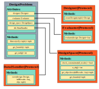

``mach_opt`` Module Overview
##########################################

The ``mach_opt`` module is designed to extend the `user-defined problem <https://esa.github.io/pygmo2/tutorials/coding_udp_simple.html>`_ definition prescribed by ``pygmo``. In order for ``pygmo`` to run a multi-objective user-defined problem, the injected object must have three functions implemented: ``fitness``, ``get_bounds``, and ``get_nobj``. The primary class of the ``mach_opt`` module is ``DesignProblem`` which implements these required functions. The flow of information between ``pygmo`` and the ``DesignProblem`` can be visualized in the following flowchart. 

.. figure:: ./images/DesOptlFlowChart.svg
   :alt: Trial1 
   :align: center
   :width: 300

	
	
The ``DesignProblem`` class expects to receive several objects upon initialization that comply with defined protocols. (Note: Python's protocol class capability was introduced in `PEP 544 <https://www.python.org/dev/peps/pep-0544/>`_.) These objects and their purpose are summarized as follows:

Designer
	The ``Designer`` protocol converts an input tuple into a ``design`` object.
Evaluator
	The ``Evaluator`` protocol evaluates the ``design`` object for a set of criteria defined in the ``evaluate`` function.
DesignSpace
	The ``DesignSpace`` protocol handles converting the results of the evaluation into the objective variables.
DataHandler
	Saves the design, evaluation results, and objective values so that optimization can be paused and resumed.

Additional details of each of these objects can be found in the code documentation. An example optimization of a rectangle using the ``mach_opt`` module can be found :doc:`here </getting_started/tutorials/rectangle_tutorial/index>`.

Designer
****************

The ``Designer`` protocol is used to convert the free variables from the optimization algorithm, into a ``design`` object. The  ``design`` object, does not have any required function calls, and is used as a container for all the information regarding the design which is to be evaluated. In order to be considered a ``Designer`` class, the ``create_design`` function must be implemented using the following function signature. 

.. code-block:: python

	@runtime_checkable
	class Designer(Protocol):
		"""Parent class for all designers

		"""
		@abstractmethod
		def create_design(self, x: 'tuple') -> 'Design':
			raise NotImplementedError

Evaluator
****************

The ``Evaluator`` protocol is used to define an evaluation procedure for the ``design`` object created by the ``Designer``. In order for a class to fulfill the role of an ``Evaluator``, the function call for the ``evaluate`` method must be defined as follows.

.. code-block:: python

	@runtime_checkable
	class Evaluator(Protocol):
		"""Parent class for all design evaluators"""
		@abstractmethod
		def evaluate(self, design: 'Design') -> Any:
			pass

DesignSpace
****************

The ``DesignSpace`` protocol is used to convert the results of the design evaluation back into a form which is usable by the optimization algorithm and provides additional functions that the ``pygmo`` algorithm requires. The following function signatures must be implemented in order to be considered a ``DesignSpace``.

.. code-block:: python

	class DesignSpace(Protocol):
		"""Parent class for a optimization DesignSpace classes"""
		@abstractmethod
		def check_constraints(self, full_results) -> bool:
			raise NotImplementedError

		@abstractmethod
		def n_obj(self) -> int:
			return NotImplementedError

		@abstractmethod
		def get_objectives(self, valid_constraints, full_results) -> tuple:
			raise NotImplementedError

		@abstractmethod
		def bounds(self) -> tuple:
			raise NotImplementedError