# Cross Section Library

The table below lists and renders the SVG files for each cross section included in the `eMach` library.

| Cross Section Name | Image |
| ----- | ----- |
| <a href='./arc'>arc</a> |  |
| <a href='./breadloaf'>breadloaf</a> |  |
| <a href='./flux_barrier_rotor'>flux_barrier_rotor</a> |  |
| <a href='./hollow_cylinder'>hollow_cylinder</a> |  |
| <a href='./hollow_rectangle'>hollow_rectangle</a> |  |
| <a href='./inner_notched_rotor'>inner_notched_rotor</a> |  |
| <a href='./inner_reluctance_rotor'>inner_reluctance_rotor</a> | 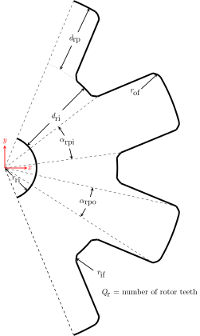 |
| <a href='./inner_rotor_drop_slots'>inner_rotor_drop_slots</a> | 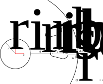 |
| <a href='./inner_rotor_drop_slots'>inner_rotor_drop_slots</a> | 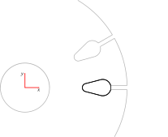 |
| <a href='./inner_rotor_drop_slots'>inner_rotor_drop_slots</a> | 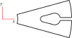 |
| <a href='./inner_rotor_round_slots'>inner_rotor_round_slots</a> | 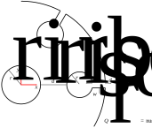 |
| <a href='./inner_rotor_round_slots'>inner_rotor_round_slots</a> | 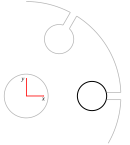 |
| <a href='./inner_rotor_round_slots'>inner_rotor_round_slots</a> | 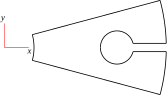 |
| <a href='./inner_rotor_round_slots_double_cage'>inner_rotor_round_slots_double_cage</a> | 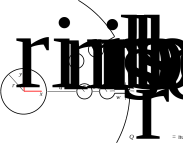 |
| <a href='./inner_rotor_round_slots_double_cage'>inner_rotor_round_slots_double_cage</a> | 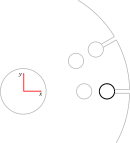 |
| <a href='./inner_rotor_round_slots_double_cage'>inner_rotor_round_slots_double_cage</a> | 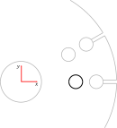 |
| <a href='./inner_rotor_round_slots_double_cage'>inner_rotor_round_slots_double_cage</a> | 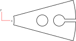 |
| <a href='./inner_rotor_stator'>inner_rotor_stator</a> | 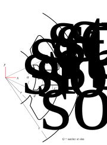 |
| <a href='./inner_rotor_stator'>inner_rotor_stator</a> | 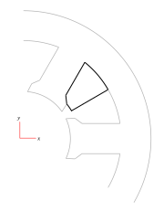 |
| <a href='./inner_rotor_stator'>inner_rotor_stator</a> | 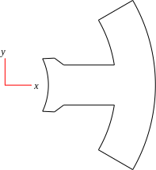 |
| <a href='./inner_rotor_stator'>inner_rotor_stator</a> | 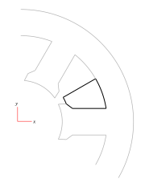 |
| <a href='./linear_motor_stator'>linear_motor_stator</a> |  |
| <a href='./notched_rectangle'>notched_rectangle</a> | 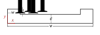 |
| <a href='./outer_rotor'>outer_rotor</a> |  |
| <a href='./outer_rotor_stator'>outer_rotor_stator</a> | 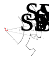 |
| <a href='./parallelogram'>parallelogram</a> |  |
| <a href='./solid_rectangle'>solid_rectangle</a> |  |
| <a href='./trapezoid'>trapezoid</a> |  |
